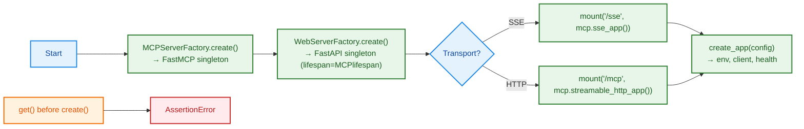

# Application Instance Factory

This page documents the application initialization pattern used to build a single global instance of the MCP server and the Web server. Both servers follow an abstract factory that enforces a singleton lifecycle and a consistent workflow.

## Abstraction: Base factory

File: [clickup_mcp/_base/app.py](https://github.com/Chisanan232/clickup-mcp-server/blob/master/clickup_mcp/_base/app.py)
 
 - **`BaseServerFactory[T]`**
  - **`create(**kwargs) -> T`**: construct and configure the server instance.
  - **`get() -> T`**: return the current instance; error if not created yet.
  - **`reset() -> None`**: clear the singleton (primarily for tests).

This abstraction standardizes lifecycle APIs for both server types.

## Concrete implementations

### MCP server factory

File: [clickup_mcp/mcp_server/app.py](https://github.com/Chisanan232/clickup-mcp-server/blob/master/clickup_mcp/mcp_server/app.py)
 
 - **`MCPServerFactory.create()`**
  - Instantiates a single `FastMCP` and asserts no prior instance exists.
 - **`MCPServerFactory.get()` / `reset()`**
  - Get or clear the singleton instance (asserts if not created yet).
- **`MCPServerFactory.lifespan()`**
  - Returns a FastAPI Lifecycle context manager that:
    - Initializes transport apps via `sse_app()` and `streamable_http_app()`.
    - Runs the MCP `session_manager` for the app lifetime.
- Default instance created at import time:
  - `mcp_factory = MCPServerFactory` and `mcp = mcp_factory.create()`.

### Web server factory

File: [clickup_mcp/web_server/app.py](https://github.com/Chisanan232/clickup-mcp-server/blob/master/clickup_mcp/web_server/app.py)
 
 - **`WebServerFactory.create()`**
  - Builds one `FastAPI` app; injects `lifespan=mcp_factory.lifespan()`.
  - Adds permissive CORS (configurable for prod).
- **`WebServerFactory.get()` / `reset()`**
  - Access or clear the singleton FastAPI app.
- **`mount_service(transport)`**
  - Mounts MCP server transports:
    - `"/sse"` for `MCPTransportType.SSE`
    - `"/mcp"` for `MCPTransportType.HTTP_STREAMING`
- **`create_app(server_config)`**
  - Loads env via `load_environment_from_file()`.
  - Creates API client via `ClickUpAPIClientFactory.create(api_token=...)`.
  - Adds `GET /health` endpoint.

## Initialization workflow (high contrast)



## Usage

### Minimal setup (explicit lifecycle)

```python
from clickup_mcp.mcp_server.app import mcp_factory
from clickup_mcp.web_server.app import web_factory, mount_service

# 1) Create servers (singleton)
mcp_factory.create()
web_factory.create()

# 2) Mount a transport (SSE or HTTP streaming)
mount_service(transport="sse")

# 3) Grab the FastAPI app and run via your ASGI server
app = web_factory.get()
```

### Full setup with config

```python
from clickup_mcp.models.cli import ServerConfig, MCPTransportType
from clickup_mcp.web_server.app import create_app

config = ServerConfig(env_file=".env", transport=MCPTransportType.SSE)
app = create_app(server_config=config)
```

### Testing utilities

```python
from clickup_mcp.mcp_server.app import mcp_factory
from clickup_mcp.web_server.app import web_factory

# Ensure clean state between tests
mcp_factory.reset()
web_factory.reset()
```

## Pros and cons

- **Pros**
  - **Predictable lifecycle**: Single point to create/get/reset servers.
  - **Unified lifespan**: Web server inherits MCP session lifecycle via `lifespan()`.
  - **Clear transport mounting**: Explicit SSE vs HTTP streaming mounts.
  - **Testability**: `reset()` allows clean isolation in test suites.
- **Cons**
  - **Global singletons**: Hidden global state can complicate advanced scenarios.
  - **Order sensitivity**: `get()` raises if called before `create()`; requires discipline.
  - **Eager instance**: MCP instance is created at import time (`mcp = create()`), which may be surprising in some contexts.

## References

- Base: [clickup_mcp/_base/app.py](https://github.com/Chisanan232/clickup-mcp-server/blob/master/clickup_mcp/_base/app.py)
- MCP server: [clickup_mcp/mcp_server/app.py](https://github.com/Chisanan232/clickup-mcp-server/blob/master/clickup_mcp/mcp_server/app.py)
- Web server: [clickup_mcp/web_server/app.py](https://github.com/Chisanan232/clickup-mcp-server/blob/master/clickup_mcp/web_server/app.py)
