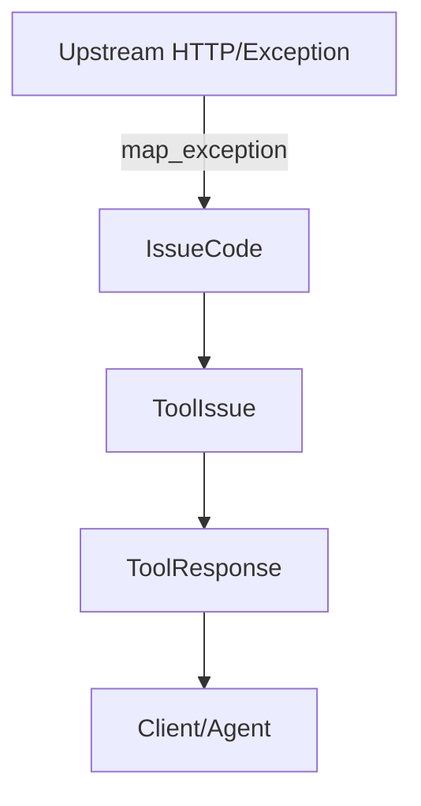
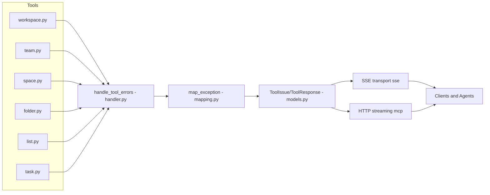
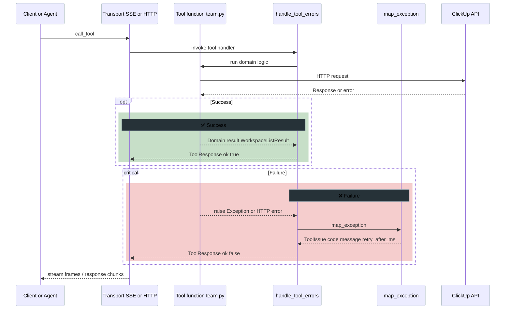
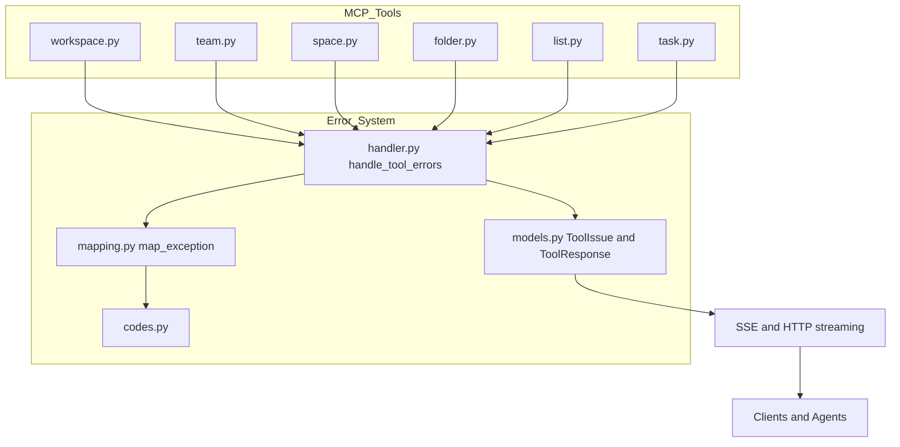

# Centralized Error Handling

This page documents the MCP server's error system, including the `ToolResponse` envelope, strict error codes, and the `@handle_tool_errors` decorator.

:::info Summary
All MCP tools return a uniform envelope at runtime: `ToolResponse[T]` containing `ok`, `result`, and `issues[]`.
:::

:::info Rationale (Problem Details + AIP-193)
Our error design follows the spirit of RFC 9457 (Problem Details) and Google AIP-193 canonical codes. We map upstream HTTP failures into concise, machine-readable `ToolIssue` codes so agents can reason and retry without parsing vendor payloads. The envelope is token-lean compared to full upstream dumps.

- RFC 9457: Problem Details for HTTP APIs
- Google AIP-193: Standard error codes and semantics
:::

## Envelope shape

```json title="ToolResponse (example)"
{
  "ok": false,
  "result": null,
  "issues": [
    {
      "code": "RATE_LIMIT",
      "message": "Rate limit exceeded",
      "retry_after_ms": 3000,
      "details": {"status_code":429}
    }
  ]
}
```

- **ok**: boolean success flag.
- **result**: typed payload when `ok: true`.
- **issues[]**: machine-readable codes with optional `retry_after_ms`.

```python title="Pydantic v2 models (simplified)"
from typing import Generic, Optional, TypeVar
from pydantic import BaseModel

T = TypeVar("T")

class ToolIssue(BaseModel):
    code: str  # VALIDATION_ERROR | PERMISSION_DENIED | NOT_FOUND | CONFLICT | RATE_LIMIT | TRANSIENT | INTERNAL
    message: str
    hint: Optional[str] = None
    retry_after_ms: Optional[int] = None

class ToolResponse(BaseModel, Generic[T]):
    ok: bool
    result: Optional[T] = None
    issues: list[ToolIssue] = []
```

## Decorator

- Module: [clickup_mcp/mcp_server/errors/handler.py](https://github.com/Chisanan232/clickup-mcp-server/blob/master/clickup_mcp/mcp_server/errors/handler.py)
- Purpose: wraps tool functions to:
  - Catch exceptions, map to standardized `ToolIssue`.
  - Expose return type annotation as `ToolResponse[...]`.

```python title="Runtime annotation exposure"
from clickup_mcp.mcp_server.errors.handler import handle_tool_errors

@handle_tool_errors
async def get_authorized_teams() -> WorkspaceListResult:  # exposed as ToolResponse[WorkspaceListResult]
    ...
```

```python title="Decorator skeleton (ParamSpec aware)"
from __future__ import annotations
from typing import Any, Awaitable, Callable, ParamSpec, TypeVar, overload
from functools import wraps
from clickup_mcp.mcp_server.errors.mapping import map_exception
from clickup_mcp.mcp_server.errors.models import ToolIssue, ToolResponse

P = ParamSpec("P")
R = TypeVar("R")

def handle_tool_errors(func: Callable[P, Awaitable[R]]) -> Callable[P, Awaitable[ToolResponse[R]]]:
    @wraps(func)
    async def wrapper(*args: P.args, **kwargs: P.kwargs) -> ToolResponse[R]:
        try:
            result = await func(*args, **kwargs)
            return ToolResponse[R](ok=True, result=result, issues=[])
        except Exception as exc:  # noqa: BLE001 - centralized mapping
            issue: ToolIssue = map_exception(exc)
            return ToolResponse[R](ok=False, result=None, issues=[issue])
    return wrapper
```

See unit tests validating annotations and wrapper behavior:
- [test/unit_test/mcp_server/errors/test_handler_annotations.py](https://github.com/Chisanan232/clickup-mcp-server/blob/master/test/unit_test/mcp_server/errors/test_handler_annotations.py)

## Mapping (HTTP → ToolIssue.code)

|    Upstream | Code           | Notes                                 |
|------------:|----------------|---------------------------------------|
|         401 | AUTH_ERROR     | Invalid/missing token                 |
|         403 | FORBIDDEN      | Insufficient permissions              |
|         404 | NOT_FOUND      | Resource missing                      |
|         409 | CONFLICT       | Versioning/state conflict             |
|         429 | RATE_LIMIT     | Include `retry_after_ms` when present |
| 5xx/timeout | UPSTREAM_ERROR | Generic upstream failure              |

```json title="Auth error (401)"
{"ok":false,"result":null,"issues":[{"code":"AUTH_ERROR","message":"Invalid API token"}]}
```

:::tip Related
User-facing guidance: see per-function Errors blocks in each MCP API page; retry/backoff details in the Errors and Retries (MCP) page.
:::

:::warning Gotchas
- Do not echo vendor payloads verbatim into `issues.details`; keep messages short and hints actionable.
- Always prefer a single, canonical `ToolIssue` over multiple near-duplicates.
- When mapping 429, parse `Retry-After` headers into `retry_after_ms` when available.
:::



## Relations to MCP tool modules

The centralized error system wraps every MCP tool in `clickup_mcp/mcp_server/*`. This diagram shows how tool functions flow through the decorator, mapping, and transports.



### End-to-end call (sequence)



### Component dependency map



These charts illustrate that all tool modules depend on `errors/handler.py` for runtime envelopes, `errors/mapping.py` for stable `IssueCode` mapping, and `errors/models.py` for the canonical `ToolResponse`/`ToolIssue` contracts, regardless of which transport is used.

### Code links

- [clickup_mcp/mcp_server/errors/codes.py](https://github.com/Chisanan232/clickup-mcp-server/blob/master/clickup_mcp/mcp_server/errors/codes.py)
- [clickup_mcp/mcp_server/errors/models.py](https://github.com/Chisanan232/clickup-mcp-server/blob/master/clickup_mcp/mcp_server/errors/models.py)
- [clickup_mcp/mcp_server/errors/handler.py](https://github.com/Chisanan232/clickup-mcp-server/blob/master/clickup_mcp/mcp_server/errors/handler.py)
- [clickup_mcp/mcp_server/errors/mapping.py](https://github.com/Chisanan232/clickup-mcp-server/blob/master/clickup_mcp/mcp_server/errors/mapping.py)

