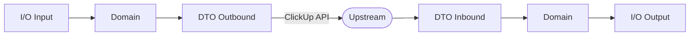

# Models — DTO vs Domain vs MCP I/O

This project separates models by concerns to keep API transport, domain behavior, and MCP contracts decoupled.

## Layers

- **DTO (Data Transfer Objects)**: mirror ClickUp API payloads for serialization/deserialization.
  - Location: [clickup_mcp/models/dto/](https://github.com/Chisanan232/clickup-mcp-server/blob/master/clickup_mcp/models/dto/)
- **Domain models**: rich entities used internally (behavior, invariants, identity-only references).
  - Location: [clickup_mcp/models/domain/](https://github.com/Chisanan232/clickup-mcp-server/blob/master/clickup_mcp/models/domain/)
- **MCP I/O models**: minimal, stable shapes exposed by MCP tools.
  - Location:
    - I (Input) [clickup_mcp/mcp_server/models/inputs/](https://github.com/Chisanan232/clickup-mcp-server/blob/master/clickup_mcp/mcp_server/models/inputs/)
    - O (Output) [clickup_mcp/mcp_server/models/outputs/](https://github.com/Chisanan232/clickup-mcp-server/blob/master/clickup_mcp/mcp_server/models/outputs/)

## Example: Workspaces (Teams)

- Domain: `ClickUpTeam` ([clickup_mcp/models/domain/team.py](https://github.com/Chisanan232/clickup-mcp-server/blob/master/clickup_mcp/models/domain/team.py))
  - Backward-compatible `id` alias → `team_id`.
- MCP output: `WorkspaceListItem`, `WorkspaceListResult`
  - Location: [clickup_mcp/mcp_server/models/outputs/workspace.py](https://github.com/Chisanan232/clickup-mcp-server/blob/master/clickup_mcp/mcp_server/models/outputs/workspace.py)
  - Tool: `get_authorized_teams()` returns `WorkspaceListResult` (decorator emits `ToolResponse[WorkspaceListResult]`).

```python title="Projection in tool"
items = [WorkspaceListItem(team_id=str(t.team_id or t.id or ""), name=t.name or "") for t in teams]
return WorkspaceListResult(items=items)
```

## Why the split?

- **Resilience** to upstream changes (DTOs may drift; MCP I/O remains stable).
- **Testability** of domain behaviors independent from transport.
- **Least surprise** for tool consumers (small, documented shapes).

:::info Rationale & JSON-Schema
MCP I/O models are the public contract. We generate JSON-Schema from these Pydantic v2 models to drive client typing and contract tests, while DTOs can evolve with upstream without breaking consumers.
:::

### Conversion pipeline



### Code links

- [clickup_mcp/models/dto/](https://github.com/Chisanan232/clickup-mcp-server/blob/master/clickup_mcp/models/dto/)
- [clickup_mcp/models/domain/](https://github.com/Chisanan232/clickup-mcp-server/blob/master/clickup_mcp/models/domain/)
- [clickup_mcp/mcp_server/models/inputs/](https://github.com/Chisanan232/clickup-mcp-server/blob/master/clickup_mcp/mcp_server/models/inputs/)
- [clickup_mcp/mcp_server/models/outputs/](https://github.com/Chisanan232/clickup-mcp-server/blob/master/clickup_mcp/mcp_server/models/outputs/)

:::tip Authoring guidance
- Keep DTOs thin: mirror upstream fields; avoid behavior.
- Enforce invariants in Domain; use identity-only references to avoid heavy graphs.
- Trim I/O outputs to what agents need; prefer stable names and small shapes.
:::

:::danger Anti-patterns
- Leaking raw upstream payloads into I/O outputs.
- Importing HTTP client concerns into Domain models.
- Hiding business rules in DTOs or I/O layers.
:::
