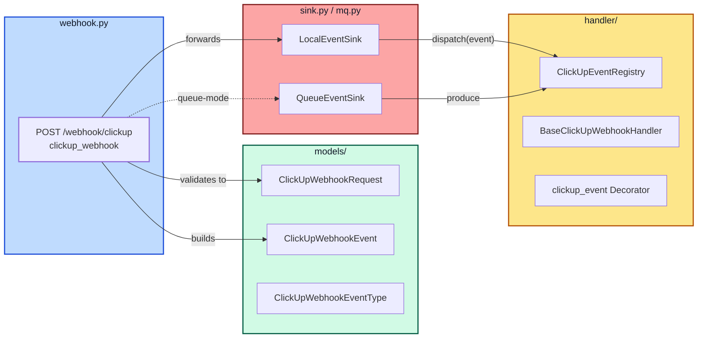
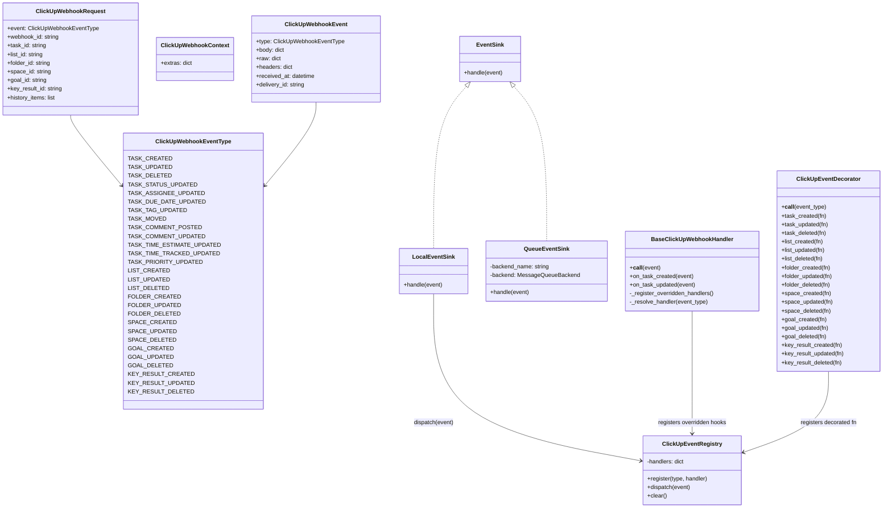
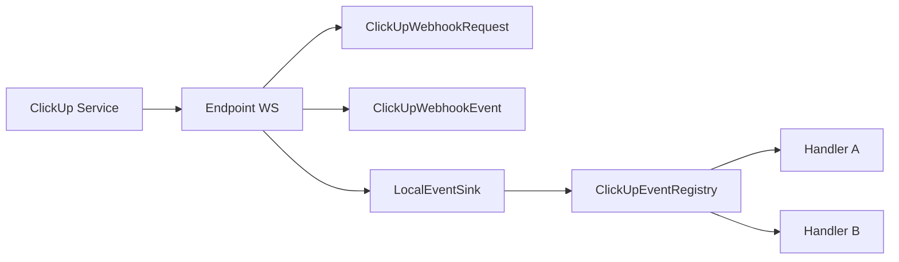
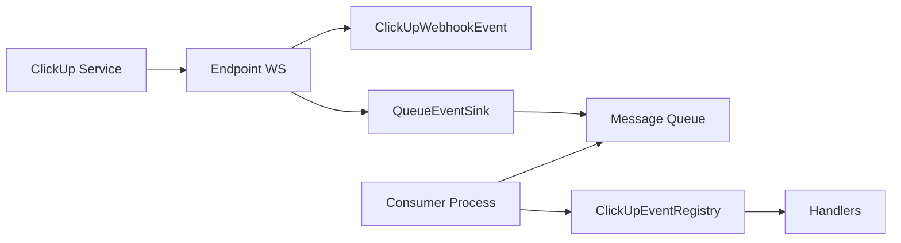

This page is a deeper, developer-focused view of the ClickUp Webhooks architecture: packages, classes, functions, and their relationships. It complements the high-level pipeline doc and endpoint docs with more detailed UML.

:::tip Related docs
- Pipeline overview: [Webhooks Pipeline](./webhooks-pipeline.mdx)
- Endpoint reference: [ClickUp Webhook Endpoint](/docs/next/api-references/web-server/endpoints/clickup-webhooks)
- Integration guide: [Webhooks Integration](/docs/next/api-references/web-server/webhooks-integration)
:::

## Package structure and responsibilities

The webhook features are organized under `clickup_mcp.web_server.event`.

```text
clickup_mcp/web_server/event/
  ├─ webhook.py            # FastAPI router: POST /webhook/clickup
  ├─ sink.py               # EventSink abstraction + selector
  ├─ mq.py                 # Queue sink + (de)serialization + consumer CLI
  ├─ bootstrap.py          # Handler auto-discovery via env var
  ├─ handler/
  │   ├─ registry.py       # Central registry (event_type -> handlers)
  │   ├─ oop.py            # BaseClickUpWebhookHandler (OOP style)
  │   └─ decorators.py     # @clickup_event decorator API (functional style)
  └─ models/
      ├─ dto.py            # ClickUpWebhookRequest + history models
      ├─ enums.py          # ClickUpWebhookEventType
      └─ models.py         # ClickUpWebhookEvent + ClickUpWebhookContext
```

## Component diagram (packages)

The following component diagram shows how the endpoint, models, handler registry, and sinks interact.



### Component diagram description

- **Endpoint**: Validates request DTO and builds a normalized `ClickUpWebhookEvent`.
- **Handlers**: A central `ClickUpEventRegistry` dispatches to either OOP handlers or decorator-registered functions.
- **Sinks**: `LocalEventSink` dispatches in-process. `QueueEventSink` publishes to a queue for async processing.
- **Routing**: `QUEUE_BACKEND` selects local or queue-mode without changing endpoint/handler code.

## Class relationships (core types)



### Class diagram description

- **ClickUpWebhookRequest** → validated input from HTTP; tolerant to extra fields.
- **ClickUpWebhookEvent** → stable, normalized event for all handlers; carries type, body, headers, timestamps, delivery id.
- **ClickUpEventRegistry** → maps `ClickUpWebhookEventType` to a list of handlers; provides `register` and `dispatch`.
- **EventSink** → abstraction; `LocalEventSink` dispatches directly; `QueueEventSink` serializes and publishes.
- **BaseClickUpWebhookHandler** → OOP hooks per event; auto-registers overridden methods into the registry.
- **ClickUpEventDecorator** → functional style; registers decorated functions to the registry.

## Object diagrams (runtime views)

### Local mode (in-process)



Description (Local):
- A request from ClickUp hits the Endpoint, which creates DTO and Event objects.
- Local sink forwards the Event to the Registry which invokes all subscribed handlers in-process.

### Queue-backed mode



Description (Queue):
- Endpoint creates the Event and sends it to the Queue sink which publishes to the message queue.
- A separate Consumer process deserializes the Event and dispatches via the Registry to handlers.

## Handler registration summary

- Decorator style: `@clickup_event.<event>` registers function handlers into the registry at import time.
- OOP style: Subclass `BaseClickUpWebhookHandler`; overridden `on_*` methods are auto-registered on instantiation.

## Extensibility and configuration

- QUEUE_BACKEND
  - `local` for in-process.
  - Any other value activates queue mode via `abstract-backend` (see that plugin’s config).
- CLICKUP_WEBHOOK_HANDLER_MODULES
  - Comma-separated modules to auto-import at startup for handler registration.

## Notes on testing and contracts

- DTOs are tolerant to extra fields and mirror ClickUp samples.
- Queue sink serialization is stable (`serialize_event`/`deserialize_event`).
- Unit and contract tests verify event types, registry behavior, and queue mode.

## References (source of truth)

- Endpoint: `clickup_mcp/web_server/event/webhook.py`
- Sinks: `clickup_mcp/web_server/event/sink.py`, `clickup_mcp/web_server/event/mq.py`
- Handlers: `clickup_mcp/web_server/event/handler/`
- Models: `clickup_mcp/web_server/event/models/`

## Design discussion: pros and cons

- **EventSink abstraction**
  - Pros: Clear separation between HTTP handling and dispatch; easy to add backends.
  - Cons: Another layer to test; queue configuration required in distributed mode.

- **Central registry with dual handler styles**
  - Pros: Uniform dispatch; teams pick OOP or decorators without fragmentation.
  - Cons: Indirection can hide where handlers are registered; requires docs/tests.

- **DTO → domain event normalization**
  - Pros: Stable handler input; decouples ClickUp payload shape from business logic.
  - Cons: Mapping step requires maintenance when payload semantics change.

- **Local vs Queue modes**
  - Local Pros: Lowest latency, simplest ops, great for dev/testing and small scale.
  - Local Cons: Coupled lifecycle with web app; spikes can impact request latency.
  - Queue Pros: Backpressure, retries, independent scaling, isolation of failures.
  - Queue Cons: More moving parts (brokers, credentials), operational overhead.

