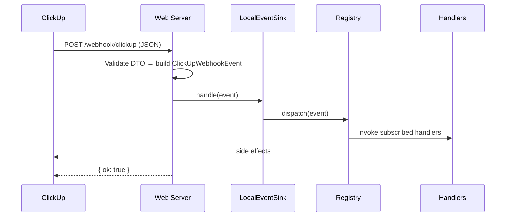
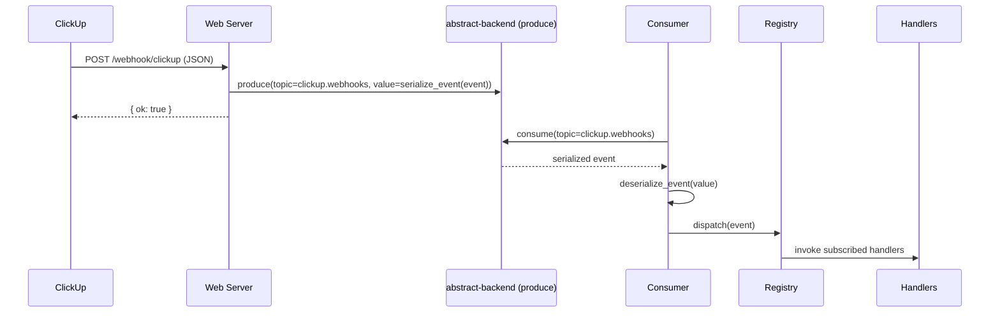

This document explains the internal architecture for receiving, producing, and consuming ClickUp webhook events in `clickup_mcp`.

:::tip See also
It is intended for developers extending or integrating the library. For end-user usage, see the endpoint reference at:
[`Docs → API References → Web Server → Endpoints → ClickUp Webhooks`](/docs/next/api-references/web-server/endpoints/clickup-webhooks).
:::

## High-level overview

- The HTTP endpoint (`POST /webhook/clickup`) validates payloads with DTOs, normalizes to a domain event, and forwards to an **Event Sink**.
- The sink implementation is selected by `QUEUE_BACKEND`:
  - `local` → handle in-process via registry and user handlers.
  - non-`local` → publish to a queue via `abstract-backend`, and a separate consumer dispatches to the same handlers.

### Core modules

- `clickup_mcp/web_server/event/models/dto.py`: Pydantic DTOs for webhook requests.
- `clickup_mcp/web_server/event/models/enums.py`: `ClickUpWebhookEventType` for all supported event types.
- `clickup_mcp/web_server/event/models/models.py`: Domain event models (`ClickUpWebhookEvent`, `ClickUpWebhookContext`).
- `clickup_mcp/web_server/event/handler/`: Registry + OOP and decorator handler styles.
- `clickup_mcp/web_server/event/sink.py`: EventSink abstraction and selection.
- `clickup_mcp/web_server/event/mq.py`: Queue sink, serialize/deserialize, and consumer loop.
- `clickup_mcp/web_server/event/bootstrap.py`: Import handler modules listed in env variables.
- `clickup_mcp/web_server/event/webhook.py`: HTTP endpoint implementation.

## Sequence diagrams

### Local (in-process) mode



### Queue-backed mode



## Event Sink abstraction

- `EventSink` interface and `LocalEventSink` live in `event/sink.py`.
- `get_event_sink()` selects implementation based on `QUEUE_BACKEND`.
- Queue sink is provided by `QueueEventSink` in `event/mq.py`.

```python
# event/sink.py
class EventSink(ABC):
    @abstractmethod
    async def handle(self, event: ClickUpWebhookEvent) -> None: ...

class LocalEventSink(EventSink):
    async def handle(self, event: ClickUpWebhookEvent) -> None:
        await get_registry().dispatch(event)
```

## Queue integration (abstract-backend)

- Module: `event/mq.py`
- Topic name: `clickup.webhooks`.
- Loader: `abstract_backend.queue.load_queue_backend` (falls back to `load_backend` if needed).
- Producer API: `backend.produce(topic, key, value)` (async or sync).
- Consumer API: `async for msg in backend.consume(topic=...)`.

### Serialization contract

```python
# event/mq.py

def serialize_event(event: ClickUpWebhookEvent) -> dict:
    return {
        "type": event.type.value,
        "body": event.body,
        "headers": dict(event.headers),
        "received_at": event.received_at.isoformat(),
        "delivery_id": event.delivery_id,
    }


def deserialize_event(message: dict) -> ClickUpWebhookEvent:
    return ClickUpWebhookEvent(
        type=ClickUpWebhookEventType(message["type"]),
        body=message["body"],
        raw=message.get("body", {}),
        headers=message.get("headers") or {},
        received_at=datetime.fromisoformat(message["received_at"]),
        delivery_id=message.get("delivery_id"),
    )
```

## Handler discovery

- Env var: `CLICKUP_WEBHOOK_HANDLER_MODULES="pkg.handlers.oop,pkg.handlers.func"`.
- Import occurs in both the web app and the consumer:
  - `app.py` → after mounting services.
  - `run_clickup_webhook_consumer()` → at startup.

```python
# event/bootstrap.py
import_handler_modules_from_env()
```

## Extending handlers

Two styles are supported out of the box and share the same registry.

- **OOP**: Subclass `BaseClickUpWebhookHandler` and override `on_*` hooks.
- **Decorator**: Use `@clickup_event(...)` or attribute-style e.g. `@clickup_event.task_created`.

All task/list/folder/space/goal/key result events from `ClickUpWebhookEventType` are supported. Hooks in `handler/oop.py` are kept in sync with the enum and fixtures.

## Configuration

- `QUEUE_BACKEND` (string)
  - `local` for in-process.
  - Any other value activates queue mode using `abstract-backend`.
- `CLICKUP_WEBHOOK_HANDLER_MODULES` (string)
  - Comma-separated list of modules to import for handler registration.
- Queue backend-specific variables
  - Managed by the respective `abstract-backend` plugin (e.g., Kafka brokers, Redis DSN). See that plugin's docs.

## Testing strategy

- Unit tests verify:
  - Sink selection and in-process dispatch.
  - Queue sink produce + consumer dispatch using a fake `abstract_backend.queue` module.
  - Serialization/deserialization round-trip.
- Contract tests validate DTO model compatibility against official ClickUp example payload fixtures.

## Backward compatibility

- The webhook endpoint behavior in `local` mode is equivalent to previous direct-dispatch behavior.
- Handlers’ signatures (`event`, `ctx` for decorators) and OOP hooks remain stable.
