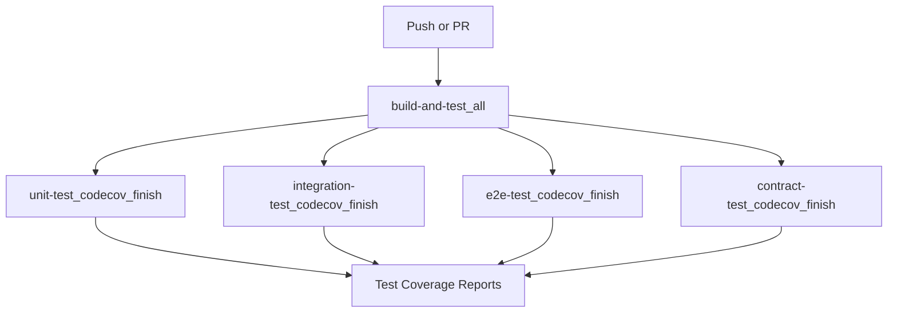
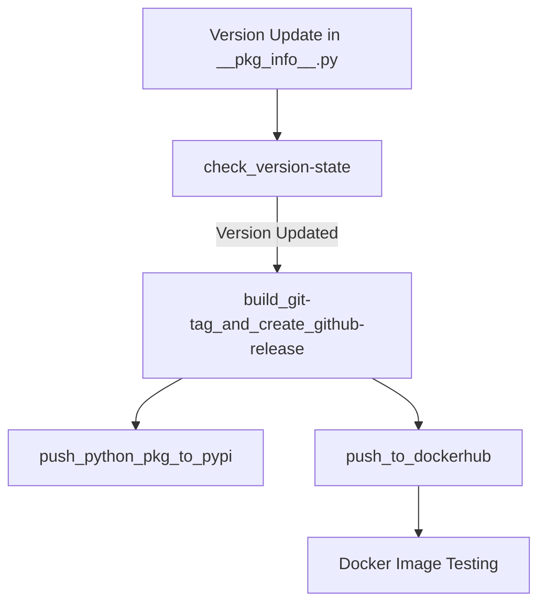

# CI/CD Workflows

This document describes the Continuous Integration and Continuous Deployment (CI/CD) workflows used in the ClickUp MCP Server project.

## CI/CD Overview

We use GitHub Actions to automate testing, code quality checks, and deployment processes. Our CI/CD pipelines help maintain code quality, ensure tests pass, and streamline the release process.

You can monitor the status of all workflows at: [GitHub Actions Dashboard](https://github.com/Chisanan232/clickup-mcp-server/actions)

## Continuous Integration

### Workflow Triggers

Our CI workflow (`ci.yaml`) is triggered on:

- **Push to master branch**: Excluding branches with "e2e" in their name
- **Pull requests to master**: Excluding branches with "e2e" in their name
- Only when specific paths are modified:
  - GitHub Actions workflow files
  - Python source code (`clickup_mcp/**/*.py`)
  - Test files (`test/**/*.py`)
  - Test configuration files (`.coveragerc`, `pytest.ini`, etc.)
  - Project configuration (`pyproject.toml`, `uv.lock`)

### CI Workflow Structure

### Main CI Workflow Steps

The CI process uses several reusable workflows to streamline the execution:

#### 1. Build and Test (`rw_build_and_test.yaml`)

- Sets up Python environment (Python 3.13)
- Installs dependencies via Poetry
- Runs unit tests, integration tests, and optionally E2E tests
- Generates test coverage reports

#### 2. Test Coverage Reporting

For each test type (unit, integration, E2E, contract), the workflow:
- Organizes and processes test coverage data
- Uploads reports to Codecov with specific flags
- Labels reports with the package name (`clickup_mcp`)

#### 3. Code Quality Checks

As part of the test process, the following checks are performed:
- **MyPy**: Type checking
- **PyLint**: Code analysis based on Google's Python style guide
- **Flake8**: PEP 8 compliance checking
- **Black**: Code formatting verification
- **isort**: Import sorting verification

## Multi-Python Version Testing

The project uses a dedicated workflow (`rw_uv_run_test_with_multi_py_versions.yaml`) to test across multiple Python versions, ensuring compatibility.

## Continuous Deployment

### Deployment Triggers

The CD workflow (`cd.yaml`) is triggered when:
- Changes are pushed to `__pkg_info__.py` files (which contain version information)
- Only on specific branches (controlled by `sample_master_never_run` in the actual config)

### CD Workflow Structure

### Main CD Workflow Steps

#### 1. Version State Checking

- Checks if the version has been updated in `__pkg_info__.py`
- Only proceeds with deployment if version has changed

#### 2. Git Tag and GitHub Release Creation

- Creates a Git tag based on the new version
- Generates release notes
- Creates a GitHub release

#### 3. PyPI Publication

- Builds the Python package using Poetry
- Publishes the package to PyPI with appropriate version type (official release)
- Uses PyPI credentials stored in GitHub Secrets

#### 4. Docker Hub Publication

- Logs in to Docker Hub
- Sets up QEMU for cross-platform builds
- Builds and exports the Docker image
- Tests the Docker image with an API token
- Pushes the image to Docker Hub

## Documentation Deployment

The documentation workflow (`documentation.yaml`) handles building and deploying project documentation:

### Documentation Workflow Triggers

- Changes to documentation files in `docs/` directory
- Changes to MkDocs configuration
- Changes to package version information

### Documentation Deployment Steps

1. **Latest Documentation Deployment**:
   - Checks out the repository
   - Sets up Python 3.13
   - Installs dependencies with Poetry
   - Builds versioned documentation using `mike`
   
2. **Version State Checking**:
   - Determines if this is a version update
   
3. **Stable Documentation Deployment**:
   - For official releases only
   - Builds and deploys the stable version of documentation
   - Updates version aliases

## Additional CI Workflows

The project includes several specialized CI workflows:

### API Specification Checking

The `check-clickup-api-spec.yaml` workflow verifies the ClickUp API specification against the implementation.

### Docker CI

The `docker-ci.yml` workflow tests Docker image building and functionality.

### DockerHub README CI

The `dockerhub-readme-ci.yml` workflow updates the Docker Hub repository description.

## CI/CD Configuration Files

All CI/CD workflows are defined in the `.github/workflows/` directory:

- `ci.yaml` - Main CI workflow
- `cd.yaml` - Main CD workflow
- `documentation.yaml` - Documentation building and deployment
- `rw_*.yaml` - Reusable workflow components
- Additional specialized workflows for Docker, API checking, etc.

You can browse all workflow definitions here:
- [Workflow Definitions](https://github.com/Chisanan232/clickup-mcp-server/tree/master/.github/workflows)

## Best Practices for Contributors

1. **Run Tests Locally**: Before submitting a PR, run tests locally to catch issues early
2. **Check CI Results**: Monitor the CI results on your PRs
3. **Fix Failing Tests**: Address any failing tests or code quality issues promptly
4. **Maintain Test Coverage**: Add tests for new features to maintain high coverage
