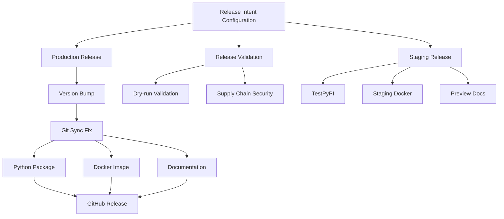
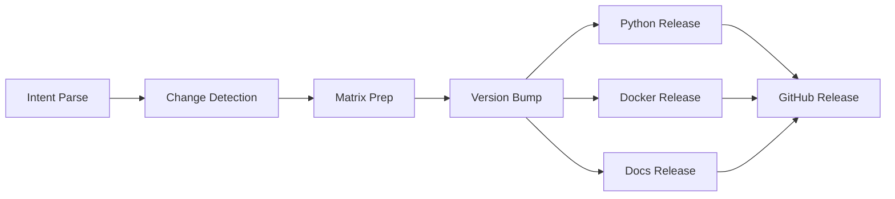
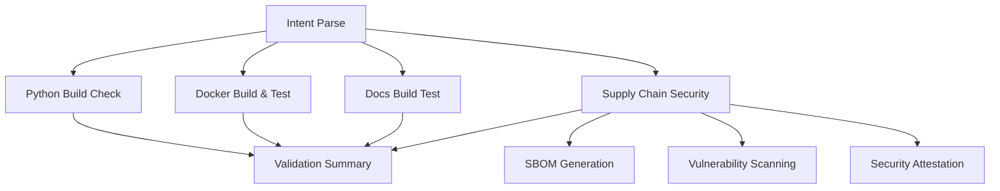
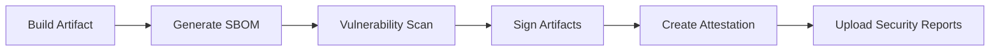
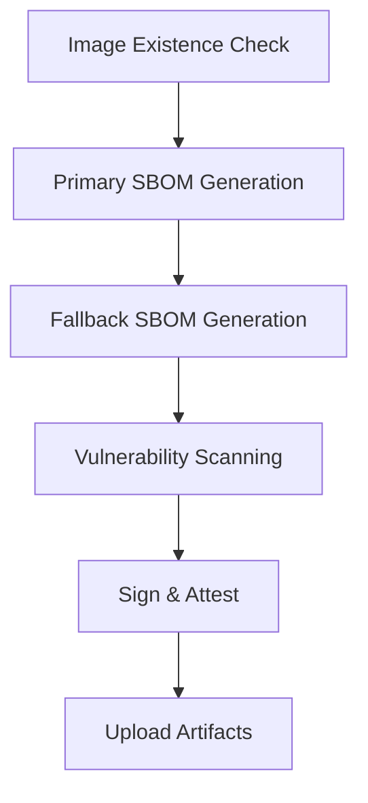

# CI/CD Workflows

This document describes the Continuous Integration and Continuous Deployment (CI/CD) workflows used in the ClickUp MCP Server project.

## CI/CD Overview

We use GitHub Actions to automate testing, code quality checks, and deployment processes. Our CI/CD pipelines help maintain code quality, ensure tests pass, and streamline the release process.

You can monitor the status of all workflows at: [GitHub Actions Dashboard](https://github.com/Chisanan232/clickup-mcp-server/actions)

## Continuous Integration

[](https://github.com/Chisanan232/clickup-mcp-server/actions/workflows/ci.yaml)
[](https://github.com/Chisanan232/clickup-mcp-server/actions/workflows/ci_includes_e2e_test.yaml)

### Workflow Triggers

Our CI workflow (`ci.yaml`) is triggered on:

- **Push to master branch**: Excluding branches with "e2e" in their name
- **Pull requests to master**: Excluding branches with "e2e" in their name
- Only when specific paths are modified:
  - GitHub Actions workflow files
  - Python source code (`clickup_mcp/**/*.py`)
  - Test files (`test/**/*.py`)
  - Test configuration files (`.coveragerc`, `pytest.ini`, etc.)
  - Project configuration (`pyproject.toml`, `uv.lock`)

### CI Workflow Structure


### Main CI Workflow Steps

The CI process uses several reusable workflows to streamline the execution:

#### 1. Build and Test (`rw_build_and_test.yaml`)

- Sets up Python environment (Python 3.13)
- Installs dependencies via Poetry
- Runs unit tests, integration tests, and optionally E2E tests
- Generates test coverage reports

#### 2. Test Coverage Reporting

For each test type (unit, integration, E2E, contract), the workflow:
- Organizes and processes test coverage data
- Uploads reports to Codecov with specific flags
- Labels reports with the package name (`clickup_mcp`)

#### 3. Code Quality Checks

As part of the test process, the following checks are performed:
- **MyPy**: Type checking
- **PyLint**: Code analysis based on Google's Python style guide
- **Flake8**: PEP 8 compliance checking
- **Black**: Code formatting verification
- **isort**: Import sorting verification

## Multi-Python Version Testing

The project uses a dedicated workflow (`rw_uv_run_test_with_multi_py_versions.yaml`) to test across multiple Python versions, ensuring compatibility.

## Release Deployment System

The project uses a comprehensive release deployment system with three main workflows:

[](https://github.com/Chisanan232/clickup-mcp-server/actions/workflows/release.yml)
[](https://github.com/Chisanan232/clickup-mcp-server/actions/workflows/release-validate.yml)
[](https://github.com/Chisanan232/clickup-mcp-server/actions/workflows/release-staging.yml)

### Release System Overview



:::info Critical Fix: Git Synchronization
A critical git synchronization issue was identified and resolved where downstream jobs (Python package, Docker, docs) were building from stale code that didn't include the version bump commit. This has been fixed by ensuring all workflows checkout the latest branch state with `ref: ${{ github.ref_name }}`.
:::

:::note Dual Registry Docker Publishing
The Docker release system publishes to **both Docker Hub and GitHub Container Registry (GHCR)** simultaneously:

- **Docker Hub**: `chisanan232/clickup-mcp-server` - Public registry for broader community access
- **GHCR**: `ghcr.io/chisanan232/clickup-mcp-server` - GitHub-integrated registry with better CI/CD integration

Both registries receive **identical images** with the **same version tags**, ensuring users can pull from either registry based on their preference or organizational requirements.
:::

### 1. Production Release Workflow (`release.yml`)

**Triggers:**
- Push to `master` branch
- Manual dispatch (`workflow_dispatch`)

**Key Features:**
- **Release Intent Parsing**: Configurable release strategy via `.github/tag_and_release/intent.yaml`
- **Version Management**: Uses `uv version` for semantic versioning with automatic `uv.lock` synchronization
- **Multi-Artifact Release**: Python package, Docker image, and documentation
- **Supply Chain Security**: SBOM generation, cosign signing, SLSA attestation
- **Multi-Section Documentation**: Selective docs versioning per section
- **Dependency Lock Synchronization**: Ensures `uv.lock` stays in sync with version bumps

#### Release Workflow Structure



#### Release Intent Configuration

The release process is controlled by `.github/tag_and_release/intent.yaml`. This configuration file provides fine-grained control over what gets released and how:

```yaml
# Basic release configuration
release: true         # true, false - Master enable/disable
level: patch          # auto, patch, minor, major - Version bump level

# Artifact-specific configuration
artifacts:
  python: auto        # auto, skip, force - Python package publishing
  docker: auto        # auto, skip, force - Docker image publishing
  
  # Enhanced multi-section docs configuration
  docs:
    mode: auto        # auto, skip, force - Docs versioning behavior
    sections:         # Array of Docusaurus sections to version
      - docs          # Main documentation
      - dev           # Development documentation
      - api           # API reference (optional)
    strategy: always  # changed, always - When to version sections

# Release notes
notes: "Release description"
```

#### Multi-Artifact Deployment

1. **Python Package** (`PyPI`):
   - Uses `uv build` and `uv publish`
   - OIDC Trusted Publishers for secure authentication
   - **Fixed**: Automatic version synchronization with git sync fix
   - **Enhanced**: `uv.lock` file automatically updated and committed with version bumps
   - Builds from correct bumped version (e.g., 0.0.1, not 0.0.0)

2. **Docker Image** (`GHCR` & `DockerHub`):
   - **Dual Registry Publishing**: Publishes to both registries simultaneously
     - **GitHub Container Registry (GHCR)**: `ghcr.io/chisanan232/clickup-mcp-server`
     - **Docker Hub**: `chisanan232/clickup-mcp-server`
   - **Parallel Publishing Jobs**: Separate jobs ensure isolated registry operations
   - **Multi-architecture builds**: amd64, arm64 support for both registries
   - **Supply Chain Security**: SBOM generation, Cosign signing, SLSA attestation
   - **Registry-Specific Authentication**: GHCR uses GitHub token, Docker Hub uses dedicated credentials
   - **Consistent Tagging**: Same version tags applied to both registries
   - **Fixed**: Uses correct version tags from git sync fix

3. **Documentation** (`Docusaurus`):
   - Multi-section versioning support
   - Change detection for selective updates
   - Matrix-based concurrent processing
   - **Fixed**: Versions using correct bumped version

### 2. Release Validation Workflow (`release-validate.yml`)

**Purpose**: Pre-release validation without publishing artifacts

**Triggers:**
- Pull requests to `master`
- Manual dispatch

**Validation Steps:**



#### Enhanced Security Validation

- **Defensive Checks**: Pre-flight image existence validation
- **Vulnerability Scanning**: Grype integration for CVE detection
- **Fallback SBOM**: Workspace scanning if Docker image scan fails
- **Supply Chain Security**: Full SBOM, signing, and attestation testing

### 3. Staging Release Workflow (`release-staging.yml`)

**Purpose**: Deploy to staging environments for testing

**Triggers:**
- Manual dispatch only (`workflow_dispatch`)

**Staging Targets:**

1. **TestPyPI**: Pre-release Python packages
2. **GHCR Staging**: Docker images with `-rc` tags
3. **Documentation Preview**: Staging documentation branch

#### Staging Validation Process

- **RC Version Generation**: Creates release candidate versions
- **Staging Artifact Testing**: Validates staging deployments
- **Preview Environment**: Safe testing environment

### Multi-Section Documentation Versioning

The release system supports advanced documentation versioning:

#### Features

- **Section-Based Versioning**: Independent versioning for `docs`, `dev`, and `api` sections
- **Change Detection**: Automatic detection of changes per section
- **Strategy Control**: Version all sections or only changed sections
- **Matrix Processing**: Concurrent versioning for performance

#### Configuration Examples

```yaml
# Legacy format (backward compatible)
docs: "auto"

# Enhanced format
docs:
  mode: "auto"
  sections: ["docs", "dev"]
  strategy: "changed"  # Only version changed sections
```

### Supply Chain Security

All release workflows include comprehensive supply chain security:

#### Security Features

- **SBOM Generation**: Software Bill of Materials with Syft
- **Vulnerability Scanning**: CVE detection with Grype
- **Digital Signing**: Cosign keyless signing
- **Attestation**: SLSA provenance attestation
- **Defensive Programming**: Pre-flight checks and clear error messages

#### Security Workflow



### Release System Benefits

✅ **Configurable**: Intent-based release configuration  
✅ **Secure**: Full supply chain security pipeline  
✅ **Validated**: Comprehensive pre-release validation  
✅ **Staged**: Safe staging environment testing  
✅ **Multi-Target**: Python, Docker, and docs deployment  
✅ **Efficient**: Matrix-based concurrent processing  
✅ **Robust**: Fallback mechanisms and defensive checks

## Reusable Workflows Architecture

The release system is built on a foundation of reusable workflows that provide standardized operations across different contexts:

### Core Reusable Workflows

#### 1. Docker Operations (`rw_docker_operations.yaml`)

**Purpose**: Standardized Docker image operations with consistent metadata outputs

**Operations:**
- `build`: Build and optionally push Docker images
- `test`: Health check and functionality testing
- `security-scan`: Comprehensive security scanning with enhanced features

**Key Features:**
- **Consistent Image Metadata**: Single source of truth for image names, tags, and references
- **Multi-Architecture Support**: amd64 and arm64 builds
- **Enhanced Security Scanning**: 
  - Defensive image existence checks
  - Grype vulnerability scanning
  - Fallback SBOM generation from workspace
  - Cosign signing and SLSA attestation

**Security Scan Operation:**


#### 2. Documentation Operations (`rw_docs_operations.yaml`)

**Purpose**: Docusaurus documentation operations with multi-section support

**Operations:**
- `build`: Build documentation
- `test`: Validate documentation build
- `version`: Create versioned documentation
- `deploy-preview`: Deploy to preview branch
- `deploy-production`: Deploy to production

**Enhanced Features:**
- **Multi-Section Versioning**: Independent versioning for `docs`, `dev`, `api` sections
- **Change Detection**: Automatic detection of changes per section using `dorny/paths-filter`
- **Matrix Processing**: Concurrent versioning jobs for performance
- **Strategy Control**: Version all sections or only changed sections

#### 3. Python Package Operations (`rw_python_package.yaml`)

**Purpose**: Python package building, testing, and publishing

**Operations:**
- `build`: Build Python packages with `uv build`
- `test`: Package installation and import testing
- `publish`: Publish to PyPI/TestPyPI with `uv publish`

**Features:**
- **UV Integration**: Modern Python package management
- **OIDC Authentication**: Secure PyPI publishing with Trusted Publishers
- **Version Synchronization**: Consistent versioning across artifacts

### Workflow Integration Pattern

The reusable workflows follow a consistent pattern:

```yaml
jobs:
  operation-name:
    uses: ./.github/workflows/rw_operation_type.yaml
    with:
      operation: 'specific-operation'
      # Operation-specific parameters
    secrets: inherit
```

**Benefits:**
- **DRY Principle**: Avoid duplicating workflow logic
- **Consistency**: Standardized operations across contexts
- **Maintainability**: Centralized workflow logic
- **Testing**: Isolated testing of workflow components

## Release Intent Configuration Reference

The `.github/tag_and_release/intent.yaml` file is the central configuration for controlling release behavior. This section provides comprehensive documentation for all available configuration options.

### Configuration Schema

```yaml
# Master release control
release: true                    # boolean - Enable/disable releases entirely

# Version bump configuration  
level: "auto"                    # string - Version bump level

# Artifact publishing configuration
artifacts:
  python: "auto"                 # string - Python package publishing
  docker: "auto"                 # string - Docker image publishing
  docs:                          # object | string - Documentation versioning
    mode: "auto"                 # string - Docs versioning mode
    sections: ["docs", "dev"]    # array - Docusaurus sections to version
    strategy: "changed"          # string - Versioning strategy

# Release notes
notes: "Release description"     # string - GitHub release notes
```

### Configuration Options

#### 1. Master Release Control

**`release`** (boolean, default: `true`)
- `true`: Enable release processing
- `false`: Skip all release operations

```yaml
# Enable releases
release: true

# Disable releases entirely
release: false
```

#### 2. Version Bump Level

**`level`** (string, default: `"auto"`)
Controls semantic version bumping:

- `"auto"`: Determine version bump automatically based on commit messages
- `"patch"`: Force patch version bump (e.g., 1.0.0 → 1.0.1)
- `"minor"`: Force minor version bump (e.g., 1.0.0 → 1.1.0)
- `"major"`: Force major version bump (e.g., 1.0.0 → 2.0.0)

```yaml
# Automatic version detection
level: auto

# Force specific version bumps
level: patch  # 1.0.0 → 1.0.1
level: minor  # 1.0.0 → 1.1.0 
level: major  # 1.0.0 → 2.0.0
```

#### 3. Python Package Configuration

**`artifacts.python`** (string, default: `"auto"`)
Controls Python package publishing to PyPI:

- `"auto"`: Publish if package files changed
- `"force"`: Always publish regardless of changes
- `"skip"`: Skip Python package publishing

```yaml
artifacts:
  # Conditional publishing (recommended)
  python: auto
  
  # Always publish
  python: force
  
  # Skip publishing
  python: skip
```

#### 4. Docker Image Configuration

**`artifacts.docker`** (string, default: `"auto"`)
Controls Docker image publishing to **both Docker Hub and GitHub Container Registry (GHCR)**:

- `"auto"`: Publish if Docker-related files changed (Dockerfile, scripts, etc.)
- `"force"`: Always publish to both registries regardless of changes
- `"skip"`: Skip Docker image publishing to both registries

```yaml
artifacts:
  # Conditional publishing (recommended)
  docker: auto    # Publishes to both registries if Docker files changed
  
  # Always publish
  docker: force   # Always publishes to both registries
  
  # Skip publishing
  docker: skip    # Skips both registries
```

:::info Dual Registry Publishing Details
When `docker: auto` or `docker: force`, the workflow creates **two parallel jobs**:

1. **Docker Hub Job** (`release_docker_dockerhub`):
   - Registry: `docker.io`
   - Image: `chisanan232/clickup-mcp-server:VERSION`
   - Authentication: DockerHub credentials (`DOCKERHUB_USERNAME`, `DOCKERHUB_TOKEN`)

2. **GHCR Job** (`release_docker_ghcr`):
   - Registry: `ghcr.io`  
   - Image: `ghcr.io/chisanan232/clickup-mcp-server:VERSION`
   - Authentication: GitHub token (`GITHUB_TOKEN`)

Both jobs run **simultaneously** and produce **identical images** with the same version tags.
:::

#### 5. Documentation Configuration

**`artifacts.docs`** (object | string)
Controls documentation versioning with support for both legacy and enhanced formats.

##### Legacy Format (String)

```yaml
artifacts:
  docs: "auto"  # auto, force, skip
```

##### Enhanced Format (Object)

```yaml
artifacts:
  docs:
    mode: "auto"              # auto, force, skip
    sections: ["docs", "dev"]  # array of section names
    strategy: "changed"       # changed, always
```

**Configuration Options:**

**`docs.mode`** (string, default: `"auto"`)
- `"auto"`: Version docs based on strategy and change detection
- `"force"`: Always version docs regardless of changes or strategy
- `"skip"`: Skip documentation versioning entirely

**`docs.sections`** (array, default: `["docs", "dev"]`)
Array of Docusaurus plugin IDs to version:
- `"docs"`: Main user documentation
- `"dev"`: Development/contributor documentation
- `"api"`: API reference documentation

**`docs.strategy`** (string, default: `"changed"`)
- `"changed"`: Only version sections that have file changes
- `"always"`: Version all configured sections regardless of changes

### Configuration Examples

#### Example 1: Conservative Release (Recommended)
```yaml
# Only release what has actually changed
release: true
level: auto
artifacts:
  python: auto
  docker: auto
  docs:
    mode: auto
    sections: ["docs", "dev"]
    strategy: changed
notes: "Automatic release with change detection"
```

#### Example 2: Force Full Release
```yaml
# Force release all artifacts regardless of changes
release: true
level: patch
artifacts:
  python: force
  docker: force
  docs:
    mode: force
    sections: ["docs", "dev", "api"]
    strategy: always
notes: "Full release of all components"
```

#### Example 3: Selective Release
```yaml
# Only release Python package, skip others
release: true
level: minor
artifacts:
  python: force
  docker: skip
  docs: skip
notes: "Python package only release"
```

#### Example 4: Documentation-Only Release
```yaml
# Only version documentation
release: true
level: patch
artifacts:
  python: skip
  docker: skip
  docs:
    mode: force
    sections: ["docs", "dev"]
    strategy: always
notes: "Documentation update release"
```

### Behavioral Matrix

| Configuration | Changed Files | Behavior |
|---------------|---------------|----------|
| `python: auto` | Python files changed | ✅ Publishes to PyPI |
| `python: auto` | No Python files changed | ⏭️ Skips publishing |
| `python: force` | Any/no changes | ✅ Always publishes |
| `python: skip` | Any/no changes | ⏭️ Always skips |
| `docs.mode: auto, strategy: changed` | Docs files changed | ✅ Versions changed sections |
| `docs.mode: auto, strategy: always` | Any changes | ✅ Versions all sections |
| `docs.mode: force` | Any/no changes | ✅ Always versions |

### Configuration Validation

The release intent parser includes JSON schema validation to ensure configuration correctness:

- **Invalid Options**: Unsupported values are rejected with clear error messages
- **Type Checking**: Ensures correct data types for all fields
- **Required Fields**: Validates that essential configuration is present
- **Default Values**: Applies sensible defaults for missing optional fields

**Example Validation Errors:**

```yaml
# ❌ Invalid configuration
level: invalid_level        # Error: Must be auto, patch, minor, or major
artifacts:
  docs:
    strategy: invalid       # Error: Must be changed or always
    sections: "not-array"   # Error: Must be array of strings
```

## Developer Guide

### Using the Release System

#### 1. Configuring a Release

Edit `.github/tag_and_release/intent.yaml` to configure your release:

```yaml
# Example: Patch release with selective docs versioning
version_bump: "patch"
python: "auto"
docker: "auto"
docs:
  mode: "auto"
  sections: ["docs", "dev"]  # Only version docs and dev sections
  strategy: "changed"        # Only version if changes detected
github_release: "auto"
```

#### 2. Triggering Releases

**Automatic Release** (Push to master):
```bash
git push origin master
# Triggers release workflow automatically
```

**Manual Release** (GitHub UI):
1. Go to Actions → Release
2. Click "Run workflow"
3. Optionally override intent configuration

#### 3. Pre-Release Validation

**For Pull Requests:**
- Release validation runs automatically on PRs to master
- Provides comprehensive validation without publishing
- Reviews security scan results and vulnerability reports

**Manual Validation:**
```bash
# Trigger validation workflow manually
gh workflow run release-validate.yml
```

#### 4. Staging Releases

**Deploy to Staging:**
```bash
# Manual staging release
gh workflow run release-staging.yml
```

**Staging Artifacts:**
- **TestPyPI**: `pip install -i https://test.pypi.org/simple/ clickup-mcp-server`
- **GHCR Staging**: `docker pull ghcr.io/chisanan232/clickup-mcp-server:1.0.0-rc.0`
- **Preview Docs**: Available on docs-preview branch

### Common Workflows

#### Release Preparation

1. **Update Code**: Make your changes and ensure tests pass
2. **Configure Intent**: Set release configuration in `intent.yaml`
3. **Validate**: Create PR and review validation results
4. **Stage** (Optional): Test in staging environment
5. **Release**: Merge to master for automatic release

#### Troubleshooting

**Git Synchronization Issues:**
- **Fixed**: Critical issue where artifacts built with old version (0.0.0) instead of bumped version (0.0.1)
- **Root Cause**: Downstream jobs used `actions/checkout@v5` without `ref` parameter, defaulting to original commit SHA
- **Solution**: All workflows now use `ref: ${{ github.ref_name }}` to checkout latest branch state
- **Impact**: Python packages, Docker images, and docs now use correct bumped version

**UV Lock File Synchronization:**
- **Enhanced**: Version bump now automatically updates `uv.lock` file to maintain dependency synchronization
- **Process**: After `uv version --bump`, the workflow runs `uv lock` to update lock file
- **Commit**: Both `pyproject.toml` and `uv.lock` are committed together in version bump
- **Benefit**: Ensures dependency lock file stays in sync with version changes

**Tag Mismatch Issues:**
- Check that Docker build and security scan jobs use consistent tags
- Validation workflow includes defensive checks to catch this early

**SBOM Generation Failures:**
- System includes fallback SBOM generation from workspace
- Check security scan artifacts for detailed logs

**Documentation Versioning Issues:**
- Verify `sections` configuration matches actual docs structure
- Use `strategy: "always"` to force versioning regardless of changes
- Check that Docusaurus plugin IDs in `sections` array exist in docusaurus.config.ts

**Intent Configuration Issues:**
- Configuration is validated against JSON schema during parsing
- Invalid configurations will fail with descriptive error messages
- Use `release-validate.yml` workflow to test configuration changes

**Common Configuration Mistakes:**

1. **Incorrect Section Names:**
   ```yaml
   # ❌ Wrong - section doesn't exist
   docs:
     sections: ["documentation", "developer"]
   
   # ✅ Correct - matches Docusaurus config
   docs:
     sections: ["docs", "dev"]
   ```

2. **Conflicting Mode and Strategy:**
   ```yaml
   # ❌ Confusing - mode skip overrides strategy
   docs:
     mode: skip
     strategy: always  # This has no effect
   
   # ✅ Clear intent
   docs:
     mode: auto
     strategy: always
   ```

3. **Legacy vs Enhanced Format Mixing:**
   ```yaml
   # ❌ Wrong - can't mix formats
   docs: auto
   docs:
     sections: ["docs"]
   
   # ✅ Choose one format consistently
   docs:
     mode: auto
     sections: ["docs", "dev"]
     strategy: changed
   ```

#### Monitoring Releases

**Release Status:**
- Monitor [Release Workflow](https://github.com/Chisanan232/clickup-mcp-server/actions/workflows/release.yml)
- Check [Validation Results](https://github.com/Chisanan232/clickup-mcp-server/actions/workflows/release-validate.yml)

**Security Reports:**
- Review vulnerability scan results in workflow summaries
- Download security artifacts for detailed analysis

**Artifact Verification:**

- **PyPI**: Check package availability and correct bumped version
  ```bash
  pip install clickup-mcp-server==<VERSION>
  ```

- **Docker Hub**: Verify Docker image availability and correct version tags
  ```bash
  docker pull chisanan232/clickup-mcp-server:<VERSION>
  docker run --rm chisanan232/clickup-mcp-server:<VERSION> --version
  ```

- **GitHub Container Registry (GHCR)**: Verify Docker image availability and correct version tags
  ```bash
  docker pull ghcr.io/chisanan232/clickup-mcp-server:<VERSION>
  docker run --rm ghcr.io/chisanan232/clickup-mcp-server:<VERSION> --version
  ```

- **Documentation**: Confirm documentation versioning with correct version
  ```bash
  # Check versioned documentation is available
  curl -s https://chisanan232.github.io/clickup-mcp-server/docs/<VERSION>/
  ```

- **Version Consistency**: All artifacts should reflect the same bumped version
  - Verify Python package, both Docker registries, and docs all use identical version tags
  - Cross-check that no artifacts still reference the old version (e.g., 0.0.0 vs 0.0.1)

### Legacy Continuous Deployment

:::info Legacy System
The following describes the legacy CD system (`cd.yaml`) which is maintained for backward compatibility but superseded by the release system above.
:::

[](https://github.com/Chisanan232/clickup-mcp-server/actions/workflows/cd.yaml)

The legacy CD workflow is triggered by changes to `__pkg_info__.py` files and includes basic version checking, Git tagging, PyPI publication, and Docker Hub publishing.

## Documentation Deployment

[](https://github.com/Chisanan232/clickup-mcp-server/actions/workflows/documentation.yaml)

The documentation workflow (`documentation.yaml`) handles building and deploying project documentation:

### Documentation Workflow Triggers

- Changes to documentation files in `docs/` directory
- Changes to MkDocs configuration
- Changes to package version information

### Documentation Deployment Steps

1. **Latest Documentation Deployment**:
   - Checks out the repository
   - Sets up Python 3.13
   - Installs dependencies with Poetry
   - Builds versioned documentation using `mike`
   
2. **Version State Checking**:
   - Determines if this is a version update
   
3. **Stable Documentation Deployment**:
   - For official releases only
   - Builds and deploys the stable version of documentation
   - Updates version aliases

## Additional CI Workflows

The project includes several specialized CI workflows:

### API Specification Checking

[](https://github.com/Chisanan232/clickup-mcp-server/actions/workflows/check-clickup-api-spec.yaml)

The `check-clickup-api-spec.yaml` workflow verifies the ClickUp API specification against the implementation.

### Docker CI

[](https://github.com/Chisanan232/clickup-mcp-server/actions/workflows/docker-ci.yml)

The `docker-ci.yml` workflow tests Docker image building and functionality.

### DockerHub README CI

[](https://github.com/Chisanan232/clickup-mcp-server/actions/workflows/dockerhub-readme-ci.yml)

The `dockerhub-readme-ci.yml` workflow updates the Docker Hub repository description.

### Documentation Auto-Approve & Auto-Merge

[](https://github.com/Chisanan232/clickup-mcp-server/actions/workflows/docs-automerge.yml)

The `docs-automerge.yml` workflow automatically approves and merges pull requests that only contain documentation changes. This streamlines the process for documentation updates by:

1. **Identifying Documentation-Only Changes**: 
   - Uses path filtering to detect changes limited to documentation files
   - Checks that no code, configuration, or infrastructure files are modified

2. **Automatic Processing**:
   - Adds a "📝 docs-only" label to qualifying PRs
   - Automatically approves the PR with a review comment
   - Enables auto-merge functionality (merge commit)

The workflow is triggered on pull request events (opened, reopened, synchronize, ready for review) targeting the master branch, but only processes PRs that are not in draft state.

#### Requirements for Auto-Merge:
- Repository must have "Allow auto-merge" enabled in settings
- Repository must have "Allow GitHub Actions to create and approve pull requests" enabled

This workflow helps reduce the maintenance burden for documentation-focused contributions while maintaining proper review processes for code changes.

## CI/CD Configuration Files

All CI/CD workflows are defined in the `.github/workflows/` directory:

- `ci.yaml` - Main CI workflow
- `cd.yaml` - Main CD workflow
- `documentation.yaml` - Documentation building and deployment
- `rw_*.yaml` - Reusable workflow components
- Additional specialized workflows for Docker, API checking, etc.

You can browse all workflow definitions here:
- [Workflow Definitions](https://github.com/Chisanan232/clickup-mcp-server/tree/master/.github/workflows)

## Best Practices for Contributors

1. **Run Tests Locally**: Before submitting a PR, run tests locally to catch issues early
2. **Check CI Results**: Monitor the CI results on your PRs
3. **Fix Failing Tests**: Address any failing tests or code quality issues promptly
4. **Maintain Test Coverage**: Add tests for new features to maintain high coverage
