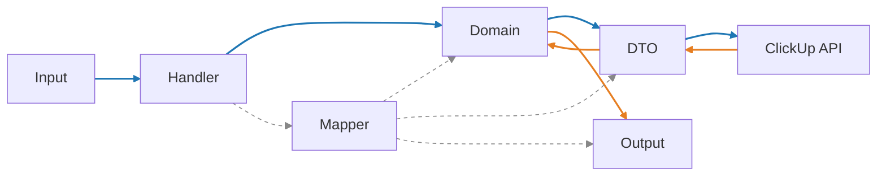

# How to create a new mapper

This guide shows how to add or extend a mapper so all conversions follow our standard pipeline:

- Input (MCP) → Domain → DTO (outbound)
- DTO (inbound) → Domain → Output (MCP)



See overview in [Architecture: Models](../architecture/models.mdx).

## 1) Define or locate the Domain model

- Location: `clickup_mcp/models/domain/`
- Ensure ID aliases match upstream (e.g., `team_id` with alias `id`).
- Keep behavior in Domain, not in DTOs or handlers.

## 2) Create the Mapper in `clickup_mcp/models/mapping/`

- Name pattern: `<resource>_mapper.py` and class `<Resource>Mapper`.
- Include three groups of methods:
  - DTO → Domain: `to_domain(resp: <RespDTO>) -> <Domain>`
  - Domain → DTO: `to_create_dto(domain)`, `to_update_dto(domain)`
  - Domain → Output: `to_*_output(domain)` for each output type used by handlers

Example (excerpt):
```python title="clickup_mcp/models/mapping/team_mapper.py"
class TeamMapper:
    @staticmethod
    def to_workspace_list_item_output(team: ClickUpTeam) -> WorkspaceListItem:
        return WorkspaceListItem(team_id=str(team.team_id or team.id or ""), name=team.name or "")

    @staticmethod
    def to_workspace_list_result_output(teams: Iterable[ClickUpTeam]) -> WorkspaceListResult:
        items = [TeamMapper.to_workspace_list_item_output(t) for t in teams]
        return WorkspaceListResult(items=items)
```

## 3) Refactor handlers to use mapper outputs

- Location: `clickup_mcp/mcp_server/<resource>.py`
- Replace any inline construction of output models with mapper calls.

Example:
```python
# Before
items = [WorkspaceListItem(team_id=str(t.team_id or t.id), name=t.name or "") for t in teams]
return WorkspaceListResult(items=items)

# After
from clickup_mcp.models.mapping.team_mapper import TeamMapper
return TeamMapper.to_workspace_list_result_output(teams)
```

## 4) Add unit tests for mapper methods

- Location: `test/unit_test/models/mapping/`
- Add tests for:
  - DTO → Domain round-trip (if applicable)
  - Domain → DTO payload correctness
  - Domain → Output methods

Examples:
- `test_team_mapper.py` (Domain → Output)
- `test_space_mapper.py` (DTO ↔ Domain, Domain → Output)

## 5) Run tests

```
uv run pytest -q test/unit_test test/contract_test
```

All green? You’re done.

## Tips

- Centralize shared parsing or normalization in `clickup_mcp/models/mapping/` (e.g., `priority.py`).
- Keep handlers thin: orchestration only, no projection logic.
- Prefer identity-only references in Domain to avoid heavy object graphs.
