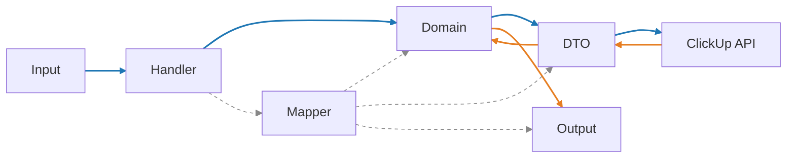

# How to create a new mapper

This guide shows how to add or extend a mapper so all conversions follow our standard pipeline:

- Input (MCP) → Domain → DTO (outbound)
- DTO (inbound) → Domain → Output (MCP)



### Input → Domain helpers

Handlers should not build domain models inline. Instead, add `from_create_input` and `from_update_input` to each mapper and call those from handlers:

```python title="clickup_mcp/models/mapping/task_mapper.py"
class TaskMapper:
    @staticmethod
    def from_create_input(input: TaskCreateInput) -> ClickUpTask:
        return ClickUpTask(
            id="temp",
            name=input.name,
            status=input.status,
            priority=normalize_priority_input(input.priority),
            assignee_ids=list(input.assignees),
            due_date=input.due_date,
            time_estimate=input.time_estimate,
            parent_id=input.parent,
        )

    @staticmethod
    def from_update_input(input: TaskUpdateInput) -> ClickUpTask:
        return ClickUpTask(
            id=input.task_id,
            name=input.name or "",
            status=input.status,
            priority=normalize_priority_input(input.priority),
            assignee_ids=list(input.assignees) if input.assignees is not None else [],
            due_date=input.due_date,
            time_estimate=input.time_estimate,
        )
```

Then in handlers:

```python title="clickup_mcp/mcp_server/task.py"
domain = TaskMapper.from_create_input(input)
dto = TaskMapper.to_create_dto(domain)
```

### DTO → Domain

Convert inbound API DTO responses into domain entities. Keep parsing/normalization here (not in handlers):

```python title="clickup_mcp/models/mapping/task_mapper.py"
class TaskMapper:
    @staticmethod
    def to_domain(resp: TaskResp) -> ClickUpTask:
        # parse priority from id suffix (e.g., "priority_2") or fallback to label
        prio = parse_priority_obj(resp.priority)
        return ClickUpTask(
            id=resp.id,
            name=resp.name,
            status=resp.status.status if resp.status else None,
            priority=prio,
            list_id=resp.list.id if resp.list else None,
            folder_id=resp.folder.id if resp.folder else None,
            space_id=resp.space.id if resp.space else None,
            assignee_ids=[u.id for u in (resp.assignees or [])],
            due_date=resp.due_date,
            time_estimate=resp.time_estimate,
            custom_fields=[cf.model_dump(exclude_none=True) for cf in (resp.custom_fields or [])],
        )
```

### Domain → DTO

Build transport DTOs for outbound API calls from domain entities. Keep this projection small and mechanical:

```python title="clickup_mcp/models/mapping/task_mapper.py"
class TaskMapper:
    @staticmethod
    def to_create_dto(task: ClickUpTask) -> TaskCreate:
        return TaskCreate(
            name=task.name,
            status=task.status,
            priority=task.priority,
            assignees=list(task.assignee_ids) or None,
            due_date=task.due_date,
            time_estimate=task.time_estimate,
            custom_fields=task.custom_fields or None,
        )

    @staticmethod
    def to_update_dto(task: ClickUpTask) -> TaskUpdate:
        return TaskUpdate(
            name=task.name,
            status=task.status,
            priority=task.priority,
            assignees=list(task.assignee_ids) or None,
            due_date=task.due_date,
            time_estimate=task.time_estimate,
        )
```

### Domain → Output

Map domain entities to MCP output models for responses returned by handlers. To avoid circular imports, import output models locally or guard them with TYPE_CHECKING:

```python title="clickup_mcp/models/mapping/task_mapper.py"
from typing import TYPE_CHECKING
if TYPE_CHECKING:
    from clickup_mcp.mcp_server.models.outputs.task import TaskListItem, TaskResult

class TaskMapper:
    @staticmethod
    def to_task_result_output(task: ClickUpTask, url: str | None = None) -> "TaskResult":
        from clickup_mcp.mcp_server.models.outputs.task import TaskResult
        prio_info = None
        if task.priority is not None:
            try:
                d = int_to_domain_priority(task.priority)
                prio_info = {"value": task.priority, "label": domain_priority_label(d)}
            except Exception:
                prio_info = None
        return TaskResult(
            id=task.id,
            name=task.name,
            status=task.status,
            priority=task.priority,
            priority_info=prio_info,
            list_id=task.list_id,
            assignee_ids=list(task.assignee_ids),
            due_date_ms=task.due_date,
            url=url,
            parent_id=task.parent_id,
        )

    @staticmethod
    def to_task_list_item_output(task: ClickUpTask, url: str | None = None) -> "TaskListItem":
        from clickup_mcp.mcp_server.models.outputs.task import TaskListItem
        return TaskListItem(id=task.id, name=task.name, status=task.status, list_id=task.list_id, url=url)
```

See overview in [Architecture: Models](../architecture/models.mdx).

:::danger Prohibited mappings and usage
- Do not convert DTO models directly to I/O models, or I/O models directly to DTO models.
- Do not implement business/core logic using I/O or DTO models.

Allowed paths:
- Input (MCP) → Domain
- DTO (API) → Domain
- Domain → DTO (for outbound API calls)
- Domain → Output (MCP)

Rationale:
- Preserves the Anti-Corruption Layer and domain purity.
- Avoids circular imports and flaky single-file test runs.
- Keeps handlers thin and mappers as the single projection point.

Enforcement tips:
- In mapper modules, put MCP imports under TYPE_CHECKING and import outputs locally inside functions.
- Handlers should call mapper helpers instead of constructing outputs/DTOs inline.
:::

## 1) Define or locate the Domain model

- Location: `clickup_mcp/models/domain/`
- Ensure ID aliases match upstream (e.g., `team_id` with alias `id`).
- Keep behavior in Domain, not in DTOs or handlers.

## 2) Create the Mapper in `clickup_mcp/models/mapping/`

- Name pattern: `<resource>_mapper.py` and class `<Resource>Mapper`.
- Include three groups of methods:
  - DTO → Domain: `to_domain(resp: <RespDTO>) -> <Domain>`
  - Domain → DTO: `to_create_dto(domain)`, `to_update_dto(domain)`
  - Domain → Output: `to_*_output(domain)` for each output type used by handlers
  - Input → Domain: `from_create_input(input)`, `from_update_input(input)`

Example (excerpt):
```python title="clickup_mcp/models/mapping/team_mapper.py"
class TeamMapper:
    @staticmethod
    def to_workspace_list_item_output(team: ClickUpTeam) -> WorkspaceListItem:
        return WorkspaceListItem(team_id=str(team.team_id or team.id or ""), name=team.name or "")

    @staticmethod
    def to_workspace_list_result_output(teams: Iterable[ClickUpTeam]) -> WorkspaceListResult:
        items = [TeamMapper.to_workspace_list_item_output(t) for t in teams]
        return WorkspaceListResult(items=items)
```

## 3) Refactor handlers to use mapper outputs

- Location: `clickup_mcp/mcp_server/<resource>.py`
- Replace any inline construction of output models with mapper calls.

Example:
```python
# Before
items = [WorkspaceListItem(team_id=str(t.team_id or t.id), name=t.name or "") for t in teams]
return WorkspaceListResult(items=items)

# After
from clickup_mcp.models.mapping.team_mapper import TeamMapper
return TeamMapper.to_workspace_list_result_output(teams)
```

## 4) Add unit tests for mapper methods

- Location: `test/unit_test/models/mapping/`
- Add tests for:
  - DTO → Domain round-trip (if applicable)
  - Domain → DTO payload correctness
  - Domain → Output methods

Examples:
- `test_team_mapper.py` (Domain → Output)
- `test_space_mapper.py` (DTO ↔ Domain, Domain → Output)

## 5) Run tests

```
uv run pytest -q test/unit_test test/contract_test
```

All green? You’re done.

## Tips

- Centralize shared parsing or normalization in `clickup_mcp/models/mapping/` (e.g., `priority.py`).
- Keep handlers thin: orchestration only, no projection logic.
- Prefer identity-only references in Domain to avoid heavy object graphs.
