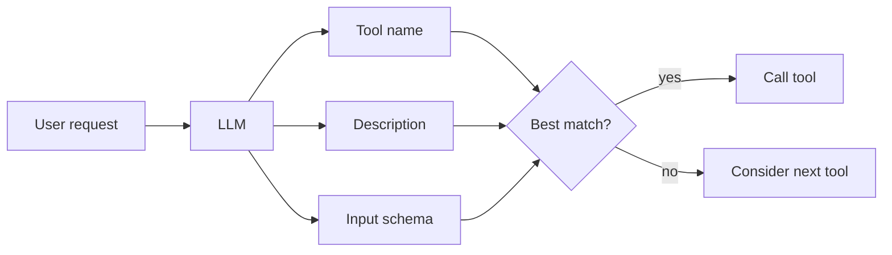

# MCP Tool Development Guidelines

This section defines how we design, implement, and document MCP tools.

## LLM-first tool design (beyond API wrapping)

MCP tools are not mere API wrappers. Their purpose is to help an LLM deeply understand:
what a service is, what each operation is for, and how to use it safely to perform
complex tasks.

- **Domain intent first**: Choose operations that reflect user intent (noun + verb), not HTTP endpoints.
- **Hide vendor quirks**: Normalize inputs/outputs and errors so tools feel consistent across providers.
- **Compose where useful**: A single tool may orchestrate multiple HTTP calls if the overall action is atomic for users.
- **Affordances and constraints**: Encode usage guidance in input models with descriptions, enums, and examples.
- **Token-lean outputs**: Return only the fields the LLM/human needs for the next step.

:::note Design note
ClickUp’s API already aligns with good domain boundaries, so many tools appear 1:1. The principle remains LLM-first: we present clear intent, consistent errors, and minimal I/O regardless of how many upstream calls are performed.
:::

```python title="Example: one tool orchestrating multiple upstream calls (still one-arg)"
@mcp.tool(name="task.create", title="Create task")
@handle_tool_errors
async def task_create(input: CreateTaskInput) -> TaskResult:
    # 1) Create task
    task = await clickup_api.create_task(list_id=input.list_id, name=input.name, description=input.description)
    # 2) Optional follow-ups (same intent from user perspective)
    if input.assignee_id:
        await clickup_api.update_task_assignee(task.id, input.assignee_id)
    if input.due_date:
        await clickup_api.update_task_due_date(task.id, input.due_date)
    # 3) Project to minimal output model
    return to_task_result(task)
```

## Principles

- **Short names** per server (e.g., `get_authorized_teams`).
- **Descriptive** `title` and `description` metadata for each tool.
- **Stable I/O**: declare return/input types in MCP model layer.
- **Name pattern**: prefer `object.operation` (e.g., `task.create`, `list.search`, `workspace.get`).
- **One-arg rule**: every tool entry point accepts exactly one parameter named `input`, whose type is the input model.

```python title="Tool definition (one-arg input model + object.operation name)"
from pydantic import BaseModel

class CreateTaskInput(BaseModel):
    list_id: str
    name: str
    description: str | None = None
    assignee_id: str | None = None

@mcp.tool(
    name="task.create",
    title="Create task",
    description="Create a new ClickUp task in a target list.",
)
@handle_tool_errors
async def task_create(input: CreateTaskInput) -> TaskResult:
    ...
```

- Inputs: use `inputs/*` models when non-trivial.
- Outputs: project domain models to minimal outputs (`WorkspaceListItem`).

## Documentation guidelines

  - What/When/Constraints (provider named in first line).
  - Input schema excerpt and links.
  - Tabs: SSE, streamable HTTP, Python client examples.
  - Pagination/permissions footguns.
  - Field-level descriptions and examples are required on all input model fields.
  - Include at least one end-to-end example payload for each tool.
  - Output schema excerpt that shows the minimal fields returned (token-lean design).

### Naming rules & best practices

:::tip Naming checklist
- Use short, specific verbs: `create`, `get`, `update`, `delete`, `search`.
- Ensure tool names are unique within a server.
- Prefer hierarchical names: `task.create` over `create_task`.
- **Object.operation** naming pattern: `task.create` over `create_task`.
- **Single-parameter input model** rule: every tool entry point takes exactly one parameter named `input`, whose type is the tool-specific input model (Pydantic v2).
- First sentence of description should state provider and “when to use”.
:::

:::tip Why `object.operation`
- **LLM comprehension**: Names like `task.create` map directly to an ontology the model already knows (noun + verb), improving tool grounding and selection.
- **Scanability**: Groups related tools under the same object prefix in UIs and logs.
- **Extensibility**: New operations fit the same namespace without renaming existing tools.
:::

:::warning Anti-patterns
- Overloading a single tool to do multiple unrelated actions.
- Encoding flags into names (e.g., `task.create_and_assign`); put options in the input schema.
- Using vague verbs (`run`, `do`, `process`).
:::

## Single-parameter input model (one-arg rule)

- **Rule**: Every MCP tool entry point must take exactly one parameter named `input`. The parameter type is the tool-specific input model (Pydantic v2).

:::tip Why a single input model?
- **LLM understanding**: A single structured object allows the LLM to learn valid fields, meanings, and when to use them for the fitting scenario.
- **Developer clarity**: Centralizes validation and docs in one place, making code more maintainable and evolvable.
:::

```python title="Input model examples"
from pydantic import BaseModel

class EmptyInput(BaseModel):
    """Use when a tool has no arguments but we still follow the one-arg rule."""
    pass

class ListSearchInput(BaseModel):
    space_id: str
    query: str
    limit: int | None = 50
```

```python title="Tool signatures"
@mcp.tool(name="workspace.get", title="Get workspace", description="Fetch a workspace by ID")
@handle_tool_errors
async def workspace_get(input: EmptyInput) -> WorkspaceResult:  # still one-arg
    ...

@mcp.tool(name="list.search", title="Search lists", description="Search lists within a space")
@handle_tool_errors
async def list_search(input: ListSearchInput) -> ListSearchResult:
    ...
```

### Input model development guidelines

- **Describe every field** using `Field(description=..., examples=[...])`.
- **Provide model-level example(s)** using `model_config = {"json_schema_extra": {"examples": [...]}}` so UIs and LLMs can show copy-pastable payloads.
- **Constrain types** with `min_length`, `max_length`, numeric bounds, and enums when applicable to narrow ambiguity.

```python title="Example: CreateTaskInput with rich field metadata"
from pydantic import BaseModel, Field
from typing import Literal

class CreateTaskInput(BaseModel):
    list_id: str = Field(
        ..., description="Target ClickUp List ID where the task will be created",
        examples=["900100000000-ABCD"],
    )
    name: str = Field(
        ..., min_length=1, max_length=256,
        description="Human-readable task name",
        examples=["Ship error handling docs"],
    )
    description: str | None = Field(
        None,
        description="Optional task description (markdown/plain)",
        examples=["Link to Docusaurus page and outline"],
    )
    assignee_id: str | None = Field(
        None,
        description="User ID to assign. If omitted, task is unassigned",
        examples=["1849201"],
    )
    priority: Literal["urgent", "high", "normal", "low"] | None = Field(
        None,
        description="Optional priority level",
        examples=["high"],
    )
    due_date: int | None = Field(
        None,
        description="Unix timestamp in milliseconds for due date",
        examples=[1731710400000],
    )

    model_config = {
        "json_schema_extra": {
            "examples": [
                {
                    "list_id": "900100000000-ABCD",
                    "name": "Ship error handling docs",
                    "description": "Add diagrams and tests",
                    "assignee_id": "1849201",
                    "priority": "high",
                    "due_date": 1731710400000,
                }
            ]
        }
    }
```

```json title="Example payload (matches the model above)"
{
  "list_id": "900100000000-ABCD",
  "name": "Ship error handling docs",
  "description": "Add diagrams and tests",
  "assignee_id": "1849201",
  "priority": "high",
  "due_date": 1731710400000
}
```

:::tip Authoring checklist for inputs
- Add `description` and at least one `examples` value for every field.
- Prefer enums (`Literal[...]`) for finite sets; otherwise document accepted values in the description.
- Use lengths and numeric bounds (`min_length`, `max_length`, etc.) to communicate constraints to the LLM and validate early.
- Provide at least one model-level example under `json_schema_extra.examples`.
:::

## Output model development guidelines

- **Export only what matters**: Output models should include the smallest set of fields required for human/LLM decision-making and follow-up calls.
- **Token-lean by design**: Favor short, flat shapes and stable names to reduce tokens for agents like ChatGPT, Gemini, Claude, etc.
- **Project from domain**: Never echo vendor payloads; map domain objects into concise `outputs/*` models.
- **Consistent conventions**:
  - Prefer `id`, `name`, `url` as canonical identifiers.
  - Use milliseconds epoch for times (suffix with `_ms`), and simple enums for statuses.
  - Keep nesting shallow; link to detail endpoints when rich data is needed.
- **Two-tier pattern**: Lists return lightweight `Item` rows; detail endpoints return a slightly richer, still minimal `Result`.

### Unified output envelope

- All MCP tools return a unified envelope: `ToolResponse[T]`.
- Shape: a small wrapper that carries success flag, the minimal `result` payload, and standardized `issues`.

```json title="ToolResponse[T] (envelope)"
{
  "ok": true,
  "result": { /* TaskResult | ListResult | ... */ },
  "issues": []
}
```

```json title="On failure"
{
  "ok": false,
  "result": null,
  "issues": [
    { "code": "RATE_LIMIT", "message": "Retry later", "retry_after_ms": 3000 }
  ]
}
```

- Rationale: keeps outputs consistent and token-lean so humans/LLMs only see what matters.
- For full details on the envelope, codes, and mapping, see [Centralized Error Handling](../architecture/error-handling).

```python title="Example: TaskResult (minimal, token-lean output)"
from typing import Literal
from pydantic import BaseModel, Field

class TaskResult(BaseModel):
    id: str = Field(..., description="ClickUp task id", examples=["86p9w7x49"])
    name: str = Field(..., description="Task name", examples=["Ship error handling docs"])
    status: Literal["open","in_progress","closed"] = Field(
        ..., description="Normalized task status",
        examples=["in_progress"],
    )
    url: str = Field(..., description="Deep link to the task in ClickUp UI")
    due_date_ms: int | None = Field(None, description="Due date as epoch ms", examples=[1731710400000])

    model_config = {
        "json_schema_extra": {
            "examples": [
                {
                    "id": "86p9w7x49",
                    "name": "Ship error handling docs",
                    "status": "in_progress",
                    "url": "https://app.clickup.com/t/86p9w7x49",
                    "due_date_ms": 1731710400000,
                }
            ]
        }
    }
```

```python title="Projection from domain -> output"
# Pseudocode to illustrate projection; actual code may differ
def to_task_result(task: DomainTask) -> TaskResult:
    return TaskResult(
        id=task.task_id,
        name=task.name,
        status=normalize_status(task.status),
        url=task.url,
        due_date_ms=task.due_date_ms,
    )
```

```json title="Example output payload (token-lean)"
{
  "id": "86p9w7x49",
  "name": "Ship error handling docs",
  "status": "in_progress",
  "url": "https://app.clickup.com/t/86p9w7x49",
  "due_date_ms": 1731710400000
}
```

:::tip Why minimal outputs?
- **Focus**: Humans/LLMs only see what they need to act next.
- **Lower cost**: Fewer tokens per tool call across providers.
- **Stability**: A narrow, curated contract changes less often than raw vendor payloads.
:::

## Discovery model (LLM selection)



## References in code

- Tool registrations live in server modules such as
  - [clickup_mcp/mcp_server/app.py](https://github.com/Chisanan232/clickup-mcp-server/blob/master/clickup_mcp/mcp_server/app.py)
  - [clickup_mcp/mcp_server/team.py](https://github.com/Chisanan232/clickup-mcp-server/blob/master/clickup_mcp/mcp_server/team.py)
  - [clickup_mcp/mcp_server/workspace.py](https://github.com/Chisanan232/clickup-mcp-server/blob/master/clickup_mcp/mcp_server/workspace.py)
  - [clickup_mcp/mcp_server/space.py](https://github.com/Chisanan232/clickup-mcp-server/blob/master/clickup_mcp/mcp_server/space.py)
  - [clickup_mcp/mcp_server/folder.py](https://github.com/Chisanan232/clickup-mcp-server/blob/master/clickup_mcp/mcp_server/folder.py)
  - [clickup_mcp/mcp_server/list.py](https://github.com/Chisanan232/clickup-mcp-server/blob/master/clickup_mcp/mcp_server/list.py)
  - [clickup_mcp/mcp_server/task.py](https://github.com/Chisanan232/clickup-mcp-server/blob/master/clickup_mcp/mcp_server/task.py)

- I/O model shapes referenced in docs
  - [clickup_mcp/mcp_server/models/inputs/](https://github.com/Chisanan232/clickup-mcp-server/blob/master/clickup_mcp/mcp_server/models/inputs/)
  - [clickup_mcp/mcp_server/models/outputs/](https://github.com/Chisanan232/clickup-mcp-server/blob/master/clickup_mcp/mcp_server/models/outputs/)
