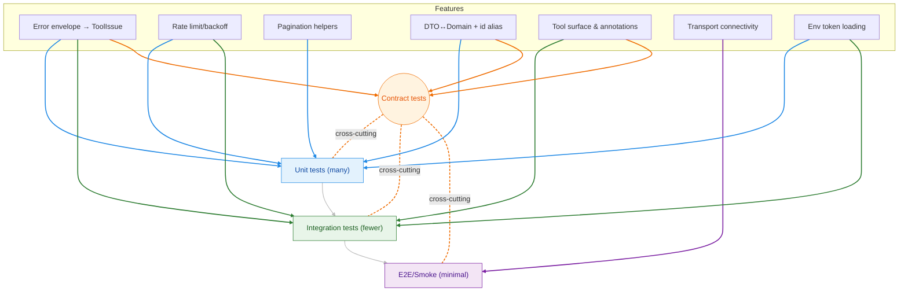

# Testing Strategy

A brief on our test pyramid and how to run tests locally.

## Layout

- Unit tests: [test/unit_test/](https://github.com/Chisanan232/clickup-mcp-server/blob/master/test/unit_test/)
  - API client behavior ([test/unit_test/test_client.py](https://github.com/Chisanan232/clickup-mcp-server/blob/master/test/unit_test/test_client.py)) including rate limiting and retries.
  - Error system: wrapper annotations and mapping.
- Integration tests: [test/integration_test/](https://github.com/Chisanan232/clickup-mcp-server/blob/master/test/integration_test/)
  - Entry points and inter-module plumbing.
- E2E tests: [test/e2e_test/](https://github.com/Chisanan232/clickup-mcp-server/blob/master/test/e2e_test/)
  - Spin up MCP server and call tools via transports (HTTP/SSE).

## Running

```bash
uv run pytest -q
# or single suite
uv run pytest -q test/unit_test/test_client.py
```

## Patterns

- Use `AsyncMock` for async context managers.
- Validate logging on errors and retry exhaustion.
- For E2E, assert tool list and tool call result shape (`WorkspaceListResult`).

:::info References
- [clickup_mcp/mcp_server/team.py](https://github.com/Chisanan232/clickup-mcp-server/blob/master/clickup_mcp/mcp_server/team.py)
- [test/e2e_test/mcp_server/test_team.py](https://github.com/Chisanan232/clickup-mcp-server/blob/master/test/e2e_test/mcp_server/test_team.py)
:::

## Test pyramid and coverage map



:::tip Legend
- **Unit** = blue
- **Integration** = green
- **E2E/Smoke** = purple
- **Contract** = orange (dotted cross-cutting edges)
:::

:::note Folder map & scope
- [test/unit_test/](https://github.com/Chisanan232/clickup-mcp-server/blob/master/test/unit_test/): models, mappers, error decorator, pagination, small helpers
- [test/integration_test/](https://github.com/Chisanan232/clickup-mcp-server/blob/master/test/integration_test/): tool handlers with fake clients; assert `ToolResponse` and 429 mapping
- [test/contract_test/](https://github.com/Chisanan232/clickup-mcp-server/blob/master/test/contract_test/): JSON-Schema snapshots for MCP inputs/outputs and ToolResponse/ToolIssue
- [test/e2e_test/](https://github.com/Chisanan232/clickup-mcp-server/blob/master/test/e2e_test/): server boots; a couple of tools succeed via HTTP/SSE
:::

### Running suites

```bash
# all tests
uv run pytest -q

# focus a folder or keyword
uv run pytest -q test/unit_test -k "errors or mapping"

# show logs on failure
uv run pytest -q -o log_cli=true -o log_cli_level=INFO
```

:::tip Contract test ideas
- Validate JSON-Schema of `ToolResponse` and `ToolIssue` against saved snapshots
- Assert `retry_after_ms` is present for 429-mapped issues
- Verify inputs accept both strict and alias fields where we promise compat
:::

:::warning Pitfalls
- Flaky E2E: keep to smoke checks; do not rely on network timing
- Overspecifying snapshots: focus on public contracts, not incidental fields
- Duplicating integration vs unit: prefer unit where possible
:::

## Responsibilities and scope

### Unit tests — focus one thing at a time

- **Goal**: verify a single function, method, or small feature in isolation.
- **Scope examples**:
  - [clickup_mcp/mcp_server/errors/mapping.py](https://github.com/Chisanan232/clickup-mcp-server/blob/master/clickup_mcp/mcp_server/errors/mapping.py) maps 401→`AUTH_ERROR`, 429→`RATE_LIMIT` and parses `Retry-After`.
  - A tool handler builds the correct ClickUp client call and request DTO (no network).
  - Pagination helpers compute correct cursors/limits.
- **How**: use local objects, fakes, or `AsyncMock`; assert return values, raised exceptions, and logs.
- **Why**: fastest feedback, cheapest to run; ensures each building block is correct.

- **Test points (brief):**
  - Error mapping to `ToolIssue.code` (401/403/404/409/429) and `Retry-After` parsing.
  - Client retries/backoff behavior and logging on exhaustion.
  - Pagination cursor/limit math for helpers.
  - DTO↔Domain mapping invariants (e.g., `id` alias properties) and serializer stability.

### Integration tests — pieces working together

- **Goal**: verify multiple functions/objects collaborate correctly without real upstream calls.
- **Scope examples**:
  - A tool function + error decorator + fake API client produce a correct `ToolResponse` on success/failure.
  - Transport-agnostic entry points use the server plumbing correctly.
- **How**: fake or stub the API client layer; assert I/O shapes, envelope, retries, and mapping.
- **Why**: catches wiring problems early while staying deterministic.

- **Test points (brief):**
  - Decorated tool functions return standardized `ToolResponse[...]` envelopes on success/failure.
  - Error paths map upstream conditions to stable issues (e.g., 429 → `RATE_LIMIT` with `retry_after_ms`).
  - Server entry points call the expected client methods with correct DTOs.
  - Environment token loading and configuration are honored by server/tool set-up.

### Contract tests — verify public contracts and abstraction layers

- **Goal**: freeze the externally-observed contracts and the internal abstraction boundaries.
- **Contracts covered**:
  - Public I/O schemas: MCP input/output models and `ToolResponse`/`ToolIssue` JSON-Schema snapshots.
  - Abstraction layers: interfaces/abstract functions are stable and respected by implementations (e.g., tool handler surface, API client facade methods, mapper interfaces).
- **How**:
  - Snapshot JSON-Schema produced from [clickup_mcp/mcp_server/models/inputs/](https://github.com/Chisanan232/clickup-mcp-server/blob/master/clickup_mcp/mcp_server/models/inputs/) and [clickup_mcp/mcp_server/models/outputs/](https://github.com/Chisanan232/clickup-mcp-server/blob/master/clickup_mcp/mcp_server/models/outputs/).
  - Assert abstract functions/objects (ABCs/Protocols) exist with the expected names and call signatures; verify concrete implementations accept the same inputs and produce the documented outputs.
  - For mapping layers, assert domain↔DTO roundtrip invariants and field alias guarantees (e.g., `id` alias on domain models such as Team/Space/List/Folder/User).
- **Why**: ensures long-term stability of both public contracts and critical internal boundaries, enabling safe refactors.

- **Test points (brief):**
  - JSON-Schema snapshots for MCP inputs/outputs and `ToolResponse`/`ToolIssue` remain compatible.
  - Enum sets and field optionality/aliases stay stable across versions.
  - ABCs/Protocols for handler surfaces and client facades preserve names and call signatures.
  - Domain↔DTO roundtrip properties hold (including `id` alias fields).

### End-to-end (smoke) tests — minimal full-path verification

- **Goal**: prove the end-to-end path is functional with minimal cost.
- **Scope**:
  - Start the MCP server, list tools, and successfully call a single MCP tool over one transport (HTTP streaming or SSE).
  - Validate envelope shape and basic success path.
- **What it intentionally does NOT do**:
  - Does not call every MCP tool.
  - Does not validate all functional permutations inside each tool.
  - Does not exercise real upstream for all behaviors.
- **Why**: the point is “the connection to MCP functions works,” not “every function detail works” (covered by unit/integration/contract tests).

- **Test points (brief):**
  - Server boots and lists tools via each transport (HTTP streaming, SSE).
  - One representative tool call returns a valid envelope and payload shape.
  - Basic error surface is observable by clients (non-OK envelope paths).

## Production feature coverage map

| Feature                                                | Covered by                                                                                                                                                                                                                                                                                |
|--------------------------------------------------------|-------------------------------------------------------------------------------------------------------------------------------------------------------------------------------------------------------------------------------------------------------------------------------------------|
| Error envelope and mapping to `ToolIssue`              | [unit](https://github.com/Chisanan232/clickup-mcp-server/blob/master/test/unit_test/), [integration](https://github.com/Chisanan232/clickup-mcp-server/blob/master/test/integration_test/), [contract](https://github.com/Chisanan232/clickup-mcp-server/blob/master/test/contract_test/) |
| Rate limit handling/backoff                            | [unit](https://github.com/Chisanan232/clickup-mcp-server/blob/master/test/unit_test/) (client), [integration](https://github.com/Chisanan232/clickup-mcp-server/blob/master/test/integration_test/) (mapping)                                                                             |
| Pagination helpers                                     | [unit](https://github.com/Chisanan232/clickup-mcp-server/blob/master/test/unit_test/)                                                                                                                                                                                                     |
| DTO↔Domain mapping and `id` alias compatibility        | [unit](https://github.com/Chisanan232/clickup-mcp-server/blob/master/test/unit_test/), [contract](https://github.com/Chisanan232/clickup-mcp-server/blob/master/test/contract_test/)                                                                                                      |
| MCP tool surface and annotations (`ToolResponse[...]`) | [integration](https://github.com/Chisanan232/clickup-mcp-server/blob/master/test/integration_test/), [contract](https://github.com/Chisanan232/clickup-mcp-server/blob/master/test/contract_test/)                                                                                        |
| Transport connectivity (HTTP/SSE)                      | [e2e](https://github.com/Chisanan232/clickup-mcp-server/blob/master/test/e2e_test/)                                                                                                                                                                                                       |
| Environment token loading (.env / config)              | [unit](https://github.com/Chisanan232/clickup-mcp-server/blob/master/test/unit_test/), [integration](https://github.com/Chisanan232/clickup-mcp-server/blob/master/test/integration_test/)                                                                                                |

## Resource-saving policy for third-party calls

:::info Policy
- “MCP tool calls the correct APIs” → cover with **unit/integration** (assert correct client method and DTO built; fake client)
- “The upstream API actually works” → cover with **API client E2E** (a dedicated suite that hits real ClickUp API)
- “MCP server path is healthy” → cover with **MCP E2E smoke** (one representative tool only)
:::

This separation minimizes network usage and flakiness. We only perform real requests in the API client’s end-to-end tests, while MCP E2E remains a fast connectivity/boot verification.
