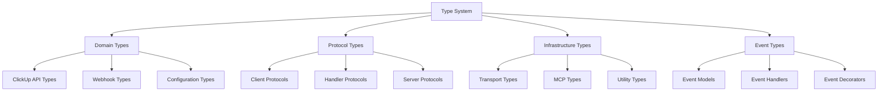

# Type System Design & Checking

This document covers the comprehensive type system design and type checking implementation in the ClickUp MCP Server project.

## Status Badges

[](https://github.com/Chisanan232/clickup-mcp-server/actions/workflows/type-check.yml)

## Overview

The ClickUp MCP Server implements a robust type system using Python's type hints and PEP 544 protocols. Our type system provides:

- **Compile-time type safety** with MyPy
- **Protocol-based abstractions** for flexible implementations
- **Domain-specific types** for ClickUp API integration
- **Event-driven architecture types** for webhook handling

## PEP Standards Compliance

This project follows these Python Enhancement Proposals for comprehensive type safety and modern Python development:

### **Core Type System PEPs**
- **[PEP 484](https://peps.python.org/pep-0484/)**: Type Hints - The foundation of Python's type hinting system
- **[PEP 544](https://peps.python.org/pep-0544/)**: Protocols: Structural subtyping (static duck typing) - Enables our protocol-based architecture
- **[PEP 585](https://peps.python.org/pep-0585/)**: Type Hinting Generics In Standard Collections - Modern generic type usage
- **[PEP 561](https://peps.python.org/pep-0561/)**: Distributing and Packaging Type Information - Package type distribution
- **[PEP 695](https://peps.python.org/pep-0695/)**: Type Parameter Syntax (Python 3.12+) - Modern type alias syntax

### **Advanced Type Features PEPs**
- **[PEP 604](https://peps.python.org/pep-0604/)**: Allow writing union types as X | Y - Used throughout our type definitions
- **[PEP 613](https://peps.python.org/pep-0613/)**: Explicit Type Aliases - For clear type alias definitions
- **[PEP 647](https://peps.python.org/pep-0647/)**: Type Guard Functions and Types - Enables our runtime type validation
- **[PEP 673](https://peps.python.org/pep-0673/)**: Self Type - Used in method return types
- **[PEP 675](https://peps.python.org/pep-0675/)**: Literal String Types - For configuration and enum-like types

### **Implementation-Specific PEPs**
- **[PEP 593](https://peps.python.org/pep-0593/)**: Annotated and Extensions for TypedDict - Used in Pydantic integration
- **[PEP 655](https://peps.python.org/pep-0655/)**: Required and NotRequired TypedDict accessors - For optional configuration fields
- **[PEP 681](https://peps.python.org/pep-0681/)**: Data Class Transforms - Used in Pydantic model definitions

## Type Module Architecture

The `clickup_mcp.types` module provides centralized type definitions following PEP 695 modern type alias syntax:

```python
# Modern PEP 695 syntax - Python 3.12+
type ClickUpTeamID = str
type ClickUpTaskID = str
type ClickUpToken = SecretStr
type LogLevel = Literal["debug", "info", "warning", "error", "critical"]
type TransportType = Literal["stdio", "sse", "http-streaming"]
type MCPToolData = Dict[str, Any]
```

### **Benefits of PEP 695 Type Syntax**
- ✅ **Cleaner syntax** - More concise than TypeAlias annotation
- ✅ **Better type inference** - Native support in type checkers
- ✅ **No forward references** - Automatic resolution without quotes
- ✅ **IDE compatibility** - Better autocompletion and error reporting
- ✅ **Future-proof** - Aligned with Python's type system evolution

### **Legacy Style (Deprecated)**
```python
# ❌ Avoid - Pre-PEP 695 style
from typing import TypeAlias
ClickUpTeamID: TypeAlias = str
```

## Type System Architecture

### Core Type Categories



## 1. Domain Types

### ClickUp API Types

Located in [`clickup_mcp/types.py`](https://github.com/Chisanan232/clickup-mcp-server/blob/master/clickup_mcp/types.py), these types provide type safety for ClickUp API interactions:

```python
# ClickUp API Identifiers
type ClickUpTeamID = str
type ClickUpTaskID = str
type ClickUpToken = SecretStr

# Type Guards for validation
def is_clickup_team_id(value: str) -> TypeGuard[ClickUpTeamID]:
    """Validate ClickUp team ID format."""
    return "." in value and len(value.split(".")) == 2

def is_clickup_task_id(value: str) -> TypeGuard[ClickUpTaskID]:
    """Validate ClickUp task ID format."""
    return "." in value and len(value.split(".")) == 2
```

### Configuration Types

Strongly typed configuration using Pydantic:

```python
type LogLevel = Literal["debug", "info", "warning", "error", "critical"]
type ServerHost = str
type ServerPort = int
type EnvironmentFile = str
```

## PEP 561 Compliance

The package includes a `py.typed` marker file to indicate it supports type checking, following [PEP 561](https://peps.python.org/pep-0561/) guidelines:

```
clickup_mcp/
├── __init__.py
├── py.typed          # PEP 561 marker file
├── types.py          # Type definitions
└── ...
```

### **PEP 561 Implementation Details**

#### **Package Structure**
- **`py.typed` marker file**: Indicates the package supports type checking
- **Type stubs**: Inline type annotations in source code
- **Public API**: All public types exported through `__all__`

#### **Distribution Benefits**
- ✅ **Consumer type checking**: Users get type safety when importing our package
- ✅ **IDE support**: Better autocompletion and error detection
- ✅ **MyPy compliance**: Full type checking across package boundaries
- ✅ **PyPI compatibility**: Proper type information in distributed packages

#### **Type Exports**
```python
# clickup_mcp/__init__.py
from clickup_mcp.types import (
    # Domain types
    ClickUpTeamID,
    ClickUpTaskID,
    ClickUpToken,
    
    # Protocol types
    EventHandlerProtocol,
    EventHandlerDecoratorProtocol,
    ClickUpClientProtocol,
    
    # Infrastructure types
    TransportType,
    MCPToolData,
)

__all__ = [
    "ClickUpTeamID",
    "ClickUpTaskID", 
    "ClickUpToken",
    "EventHandlerProtocol",
    "EventHandlerDecoratorProtocol",
    "ClickUpClientProtocol",
    "TransportType",
    "MCPToolData",
]
```

## 2. Protocol Types

Our protocol-based architecture enables flexible implementations while maintaining type safety:

### Client Protocol

Following [PEP 544](https://peps.python.org/pep-0544/) structural subtyping, our client protocol defines the interface for ClickUp API interactions:

```python
@runtime_checkable
class ClickUpClientProtocol(Protocol):
    """Protocol for ClickUp API clients."""
    
    async def get(self, endpoint: str, params: dict[str, Any] | None = ..., headers: dict[str, str] | None = ...) -> ClickUpAPIResponse:
        """Make a GET request to the ClickUp API."""
        ...
    
    async def post(self, endpoint: str, data: dict[str, Any] | None = ..., params: dict[str, Any] | None = ..., headers: dict[str, str] | None = ...) -> ClickUpAPIResponse:
        """Make a POST request to the ClickUp API."""
        ...
```

**PEP 544 Protocol Features:**
- ✅ **Structural subtyping**: Any class with matching methods implements the protocol
- ✅ **Runtime checking**: `@runtime_checkable` enables `isinstance()` checks
- ✅ **Explicit signatures**: Clear method contracts for type checkers
- ✅ **Forward compatibility**: New implementations can follow the protocol

### Event Handler Protocols

We implement a producer-consumer pattern for event handling using PEP 544 protocols:

#### Consumer Protocol (Event Handlers)
```python
@runtime_checkable
class EventHandlerProtocol(Protocol):
    """Protocol for ClickUp webhook event handlers."""
    
    def __call__(self, event: "ClickUpWebhookEvent") -> Awaitable[None]:
        """Handle a ClickUp webhook event."""
        ...
```

#### Producer Protocol (Decorator Factories)
```python
@runtime_checkable
class EventHandlerDecoratorProtocol(Protocol):
    """Protocol for event handler decorator factories."""
    
    def __call__(self, event_type: "ClickUpWebhookEventType") -> Callable[["EventHandlerProtocol"], "EventHandlerProtocol"]:
        """Create a decorator for the specified event type."""
        ...
```

**Protocol Usage Examples:**
```python
# Runtime protocol checking
def register_handler(handler: EventHandlerProtocol) -> None:
    if isinstance(handler, EventHandlerProtocol):
        # Type-safe operations guaranteed
        pass

# Structural typing - any callable with matching signature works
@clickup_event.task_created
async def my_handler(event: ClickUpWebhookEvent) -> None:
    pass

# Automatically implements EventHandlerProtocol
handler: EventHandlerProtocol = my_handler
```

### Other Protocol Types

- **EventSinkProtocol**: For event processing sinks
- **MCPServerProtocol**: For MCP server implementations  
- **MCPToolProtocol**: For MCP tool implementations

All protocols use `@runtime_checkable` decorator to enable runtime type checking following [PEP 544](https://peps.python.org/pep-0544/#runtime-checkable).

## 3. Infrastructure Types

### Transport Types

```python
type TransportType = Literal["stdio", "sse", "http-streaming"]
type QueueBackend = Literal["memory", "redis"]
```

### MCP Types

Consolidated MCP tool data types:

```python
type MCPToolData = Dict[str, Any]
"""Unified type for all MCP tool-related data."""
```

## 4. Event Types

### Event Models

```python
class ClickUpWebhookEvent:
    """Normalized ClickUp webhook event."""
    
    def __init__(self, raw: dict[str, Any], headers: dict[str, str], received_at: datetime):
        self.raw = raw
        self.headers = headers
        self.received_at = received_at
        self.type = ClickUpWebhookEventType(raw.get("event"))
        self.body = raw.get("body", {})
```

### Event Handler Patterns

#### Decorator Style
```python
@clickup_event.task_created
async def handle_task_created(event: ClickUpWebhookEvent) -> None:
    print(f"Task created: {event.body.get('task_id')}")

handler: EventHandlerProtocol = handle_task_created
```

#### OOP Style
```python
class TaskHandler(BaseClickUpWebhookHandler):
    async def on_task_created(self, event: ClickUpWebhookEvent) -> None:
        print(f"Task created: {event.body.get('task_id')}")

handler: EventHandlerProtocol = TaskHandler()
```

## Type Checking Implementation

### MyPy Configuration

Our MyPy configuration ensures comprehensive type checking:

```yaml
# .github/workflows/type-check.yml
- name: Type Check
  run: |
    uv run mypy clickup_mcp/
    uv run mypy test/
```

### Type Checking Workflow

The [type-check.yml](https://github.com/Chisanan232/clickup-mcp-server/blob/master/.github/workflows/type-check.yml) workflow:

1. **Protocol Accessibility**: Verifies all protocol types are exported
2. **Protocol Implementation**: Tests protocol compliance
3. **Type Guard Validation**: Ensures type guards work correctly
4. **Consolidated Type Testing**: Validates unified type usage
5. **Import Resolution**: Checks forward references and conditional imports

### Type Safety Features

#### Forward References
```python
if TYPE_CHECKING:
    from clickup_mcp.web_server.event.models import ClickUpWebhookEvent, ClickUpWebhookEventType
```

#### Runtime Protocol Checking
```python
@runtime_checkable
class EventHandlerProtocol(Protocol):
    ...
    
# Usage
def register_handler(handler: EventHandlerProtocol) -> None:
    if isinstance(handler, EventHandlerProtocol):
        # Type-safe operations
        pass
```

## Type Design Principles

### 1. Reality-Based Design

- Protocols match actual usage patterns
- No theoretical over-engineering
- Signatures reflect real behavior

### 2. Producer-Consumer Separation

- Clear distinction between factories and handlers
- Separate protocols for different roles
- Type-safe interfaces for each component

### 3. Consolidation Over Duplication

- Unified `MCPToolData` type instead of multiple similar types
- Single source of truth for type definitions
- Reduced cognitive load

### 4. Protocol-Based Abstraction

- Structural typing with PEP 544
- Interface compliance without inheritance constraints
- Flexible implementations

## Type System Benefits

### 1. Compile-Time Safety
- **Error Detection**: Type errors caught before runtime
- **IDE Support**: Better autocompletion and refactoring
- **Documentation**: Types serve as living documentation

### 2. Architectural Clarity
- **Clear Contracts**: Protocols define explicit interfaces
- **Role Separation**: Different types for different responsibilities
- **Extensibility**: New implementations can follow established patterns

### 3. Developer Experience
- **Type Hints**: IDE shows expected types and parameters
- **Error Messages**: Clear type mismatch information
- **Refactoring Safety**: Type-aware refactoring tools work correctly

## Best Practices

### 1. Always Use Type Annotations (PEP 484)

Following [PEP 484](https://peps.python.org/pep-0484/) guidelines for comprehensive type coverage:

```python
# ✅ Good: Complete type annotations
def process_event(handler: EventHandlerProtocol, event: ClickUpWebhookEvent) -> None:
    await handler(event)

# ✅ Good: Return type annotations
def create_client(token: ClickUpToken) -> ClickUpClientProtocol:
    return ClickUpClient(token)

# ✅ Good: Variable type annotations
team_id: ClickUpTeamID = "12345678.team"
task_data: MCPToolData = {"task_id": team_id, "name": "Example"}

# ❌ Avoid: Missing type annotations
def process_event(handler, event):
    await handler(event)
```

### 2. Use Protocol Types for Flexibility (PEP 544)

Leverage [PEP 544](https://peps.python.org/pep-0544/) structural subtyping for flexible APIs:

```python
# ✅ Good: Accept any object that implements the protocol
def register_handler(handler: EventHandlerProtocol) -> None:
    if isinstance(handler, EventHandlerProtocol):
        # Type-safe operations guaranteed by PEP 544
        pass

# ✅ Good: Protocol-based dependency injection
class EventProcessor:
    def __init__(self, client: ClickUpClientProtocol) -> None:
        self.client = client
    
    async def process(self, event: ClickUpWebhookEvent) -> None:
        # Any client implementing the protocol works
        response = await self.client.get("/team", params={"team_id": event.team_id})

# ❌ Avoid: Concrete types in public APIs
def register_handler(handler: BaseClickUpWebhookHandler) -> None:
    # Limits flexibility and violates PEP 544 principles
    pass
```

### 3. Leverage Type Guards (PEP 647)

Use [PEP 647](https://peps.python.org/pep-0647/) type guard functions for runtime validation:

```python
# ✅ Good: Type guards with TypeGuard
def process_team_id(team_id: str) -> None:
    if is_clickup_team_id(team_id):
        # Type checker knows team_id is ClickUpTeamID here
        call_clickup_api(team_id)  # Type-safe
    else:
        raise ValueError(f"Invalid team ID: {team_id}")

# ✅ Good: Type guards in data validation
def validate_event_data(data: dict[str, Any]) -> ClickUpWebhookEvent:
    if not isinstance(data.get("team_id"), str):
        raise ValueError("Missing team_id")
    
    team_id = data["team_id"]
    if not is_clickup_team_id(team_id):
        raise ValueError(f"Invalid team ID format: {team_id}")
    
    # Type checker knows team_id is valid ClickUpTeamID
    return ClickUpWebhookEvent(data, {}, datetime.now())

# ❌ Avoid: Manual type checking without guards
def process_team_id(team_id: str) -> None:
    if "." in team_id and len(team_id.split(".")) == 2:
        # Type checker doesn't know team_id is ClickUpTeamID
        call_clickup_api(team_id)  # Type error
```

### 4. Use TYPE_CHECKING for Import Optimization (PEP 484)

Follow [PEP 484](https://peps.python.org/pep-0484/#forward-references) guidelines for forward references:

```python
# ✅ Good: Conditional imports to avoid circular dependencies
from __future__ import annotations
from typing import TYPE_CHECKING, Any

if TYPE_CHECKING:
    from clickup_mcp.web_server.event.models import ClickUpWebhookEvent
    from clickup_mcp.web_server.event.models import ClickUpWebhookEventType

@runtime_checkable
class EventHandlerProtocol(Protocol):
    def __call__(self, event: "ClickUpWebhookEvent") -> Awaitable[None]:
        ...

# ✅ Good: Runtime imports inside functions
def create_event_processor() -> "EventProcessor":
    from clickup_mcp.web_server.event.consumer import EventProcessor
    return EventProcessor()

# ❌ Avoid: Circular imports
from clickup_mcp.web_server.event.models import ClickUpWebhookEvent  # May cause circular import

@runtime_checkable
class EventHandlerProtocol(Protocol):
    def __call__(self, event: ClickUpWebhookEvent) -> Awaitable[None]:  # Import error
        ...
```

### 5. Use Modern Type Alias Syntax (PEP 695)

Adopt [PEP 695](https://peps.python.org/pep-0695/) for cleaner type definitions:

```python
# ✅ Good: Modern PEP 695 syntax (Python 3.12+)
type ClickUpTeamID = str
type ClickUpTaskID = str
type LogLevel = Literal["debug", "info", "warning", "error", "critical"]

# ✅ Good: Generic type aliases
type ApiResponse[T] = dict[str, T]
type EventHandler[T] = Callable[[T], Awaitable[None]]

# ❌ Avoid: Legacy TypeAlias syntax
from typing import TypeAlias
ClickUpTeamID: TypeAlias = str
LogLevel: TypeAlias = Literal["debug", "info", "warning", "error", "critical"]
```

### 6. Use Union Types with PEP 604 Syntax

Leverage [PEP 604](https://peps.python.org/pep-0604/) for cleaner union types:

```python
# ✅ Good: Modern union syntax (PEP 604)
def process_data(data: str | int | None) -> str:
    return str(data) if data is not None else "default"

# ✅ Good: Optional types
def get_config(key: str) -> str | None:
    return os.getenv(key)

# ✅ Good: Complex unions
type ProcessResult = dict[str, Any] | list[dict[str, Any]] | str

# ❌ Avoid: Legacy Union syntax
from typing import Union, Optional

def process_data(data: Union[str, int, None]) -> str:
    return str(data) if data is not None else "default"

def get_config(key: str) -> Optional[str]:
    return os.getenv(key)
```

### 7. Use Literal Types for Enums (PEP 586)

Follow [PEP 586](https://peps.python.org/pep-0586/) for enum-like type safety:

```python
# ✅ Good: Literal types for fixed values
type LogLevel = Literal["debug", "info", "warning", "error", "critical"]
type TransportType = Literal["stdio", "sse", "http-streaming"]
type ClickUpWebhookEventType = Literal["task.created", "task.updated", "task.deleted"]

# ✅ Good: Function parameters with literals
def set_log_level(level: LogLevel) -> None:
    # Type checker ensures only valid values
    pass

# ✅ Good: Return type constraints
def get_transport_type() -> TransportType:
    return "sse"  # Type checker validates this is valid

# ❌ Avoid: String types without constraints
type LogLevel = str  # Allows any string
def set_log_level(level: LogLevel) -> None:
    # Could receive invalid values like "invalid"
    pass
```

### 8. Use Self Type for Methods (PEP 673)

Apply [PEP 673](https://peps.python.org/pep-0673/) for method return types:

```python
# ✅ Good: Self type for method chaining
class ClickUpClient:
    def __init__(self, token: ClickUpToken) -> None:
        self.token = token
    
    def with_timeout(self, timeout: int) -> Self:
        self.timeout = timeout
        return self
    
    def with_retry(self, retry_count: int) -> Self:
        self.retry_count = retry_count
        return self

# ✅ Good: Self type for builder patterns
class ConfigBuilder:
    def __init__(self) -> None:
        self.config: dict[str, Any] = {}
    
    def set_host(self, host: str) -> Self:
        self.config["host"] = host
        return self
    
    def set_port(self, port: int) -> Self:
        self.config["port"] = port
        return self

# ❌ Avoid: Hard-coded class names
class ClickUpClient:
    def with_timeout(self, timeout: int) -> ClickUpClient:
        # Breaks inheritance
        return self
```

## Troubleshooting

### Common Type Issues

#### 1. Protocol Signature Mismatch
```python
# Error: Signature incompatible with supertype
# Solution: Ensure implementation matches protocol exactly
class MyClient(ClickUpClientProtocol):
    async def get(self, endpoint: str, params: dict[str, Any] | None = None, headers: dict[str, str] | None = None) -> ClickUpAPIResponse:
        # Implementation must match protocol signature
```

#### 2. Forward Reference Issues
```python
# Error: Name "ClickUpWebhookEvent" is not defined
# Solution: Add to TYPE_CHECKING block
if TYPE_CHECKING:
    from clickup_mcp.web_server.event.models import ClickUpWebhookEvent
```

#### 3. Import Resolution
```python
# Error: Circular import
# Solution: Use conditional imports and forward references
```

### Type Checking Commands

```bash
# Run type checking locally
uv run pre-commit run mypy --all-files

# Check specific module
uv run mypy clickup_mcp/types.py

# Strict mode checking
uv run mypy --strict clickup_mcp/
```

## Migration Guide

### From Concrete Types to Protocols

```python
# Before
def register_handler(handler: BaseClickUpWebhookHandler) -> None:
    pass

# After
def register_handler(handler: EventHandlerProtocol) -> None:
    pass
```

### From Multiple Types to Consolidated Types

```python
# Before
type MCPToolInput = Dict[str, Any]
type MCPToolOutput = Dict[str, Any]
type MCPToolArguments = Dict[str, Any]

# After
type MCPToolData = Dict[str, Any]
```

---

## Navigation

- **🏠 [CI/CD Overview](./index.mdx)** - Return to main CI/CD hub
- **📋 [Continuous Integration](./continuous-integration.mdx)** - Learn about CI workflows
- **⚙️ [Additional CI Workflows](./additional-ci-workflows.mdx)** - Specialized utility workflows
- **🛠️ [Developer Guide](./developer-guide.mdx)** - Configuration and troubleshooting

## External Resources

### **Python Enhancement Proposals (PEPs)**

#### **Core Type System PEPs**
- **[PEP 484](https://peps.python.org/pep-0484/)**: Type Hints - Foundation of Python's type hinting system
- **[PEP 544](https://peps.python.org/pep-0544/)**: Protocols: Structural subtyping (static duck typing) - Enables our protocol-based architecture
- **[PEP 585](https://peps.python.org/pep-0585/)**: Type Hinting Generics In Standard Collections - Modern generic type usage
- **[PEP 561](https://peps.python.org/pep-0561/)**: Distributing and Packaging Type Information - Package type distribution
- **[PEP 695](https://peps.python.org/pep-0695/)**: Type Parameter Syntax - Modern type alias syntax (Python 3.12+)

#### **Advanced Type Features PEPs**
- **[PEP 604](https://peps.python.org/pep-0604/)**: Allow writing union types as X | Y - Modern union syntax
- **[PEP 613](https://peps.python.org/pep-0613/)**: Explicit Type Aliases - Clear type alias definitions
- **[PEP 647](https://peps.python.org/pep-0647/)**: Type Guard Functions and Types - Runtime type validation
- **[PEP 673](https://peps.python.org/pep-0673/)**: Self Type - Method return type for inheritance
- **[PEP 675](https://peps.python.org/pep-0675/)**: Literal String Types - Enum-like type safety

#### **Implementation-Specific PEPs**
- **[PEP 593](https://peps.python.org/pep-0593/)**: Annotated and Extensions for TypedDict - Pydantic integration
- **[PEP 655](https://peps.python.org/pep-0655/)**: Required and NotRequired TypedDict accessors - Optional configuration fields
- **[PEP 681](https://peps.python.org/pep-0681/)**: Data Class Transforms - Pydantic model definitions
- **[PEP 586](https://peps.python.org/pep-0586/)**: Literal Types - Enum-like type safety

#### **Historical and Reference PEPs**
- **[PEP 3107](https://peps.python.org/pep-3107/)**: Function Annotations - Original function annotation syntax
- **[PEP 526](https://peps.python.org/pep-0526/)**: Variable Annotations - Variable type hints
- **[PEP 560](https://peps.python.org/pep-0560/)**: Core support for the typing module and generic types

### **Type Checking Tools**

#### **MyPy Resources**
- **[MyPy Documentation](https://mypy.readthedocs.io/)** - Comprehensive MyPy guide
- **[MyPy Configuration](https://mypy.readthedocs.io/en/stable/config_file.html)** - Configuration options
- **[MyPy Protocols](https://mypy.readthedocs.io/en/stable/protocols.html)** - Protocol usage guide
- **[MyPy Type Guards](https://mypy.readthedocs.io/en/stable/type_narrowing.html)** - Type narrowing and guards

#### **Alternative Type Checkers**
- **[Pyright](https://github.com/microsoft/pyright)** - Microsoft's type checker
- **[Pyre](https://pyre-check.org/)** - Facebook's type checker
- **[Pytype](https://google.github.io/pytype/)** - Google's type checker

### **Python Documentation**

#### **Standard Library**
- **[Python Type Hints](https://docs.python.org/3/library/typing.html)** - Official typing module documentation
- **[Python Data Model](https://docs.python.org/3/reference/datamodel.html)** - Object protocol and typing
- **[Python Annotations](https://docs.python.org/3/reference/expressions.html#function-definitions)** - Function annotation syntax

#### **Python Guides**
- **[Python Typing Cheat Sheet](https://mypy.readthedocs.io/en/stable/cheat_sheet_py3.html)** - Quick reference
- **[Python Typing Tutorial](https://docs.python.org/3/tutorial/annotations.html)** - Official tutorial

### **Community Resources**

#### **Articles and Tutorials**
- **[Real Python - Python Type Checking](https://realpython.com/python-type-checking/)** - Comprehensive guide
- **[Effective Python Type Hints](https://adamj.eu/tech/2021/05/19/python-type-hints/)** - Best practices
- **[Python Protocols Guide](https://blog.frank-michel.com/2020/07/04/python-protocols-structural-subtyping/)** - Protocol deep dive

#### **Conference Talks**
- **[Python Type Hints - The Basics](https://www.youtube.com/watch?v=1FHTgELa5j8)** - Introduction talk
- **[Advanced Type Hints](https://www.youtube.com/watch?v=7KAm_hXoMj8)** - Advanced concepts

### **Related Projects**

#### **Type-Safe Libraries**
- **[Pydantic](https://pydantic-docs.helpmanual.io/)** - Data validation using type hints
- **[FastAPI](https://fastapi.tiangolo.com/)** - Type-safe API framework
- **[SQLModel](https://sqlmodel.tiangolo.com/)** - Type-safe SQL models

#### **Type System Examples**
- **[Slack MCP Server](https://github.com/Chisanan232/slack-mcp-server)** - Reference implementation
- **[FastAPI Source](https://github.com/tiangolo/fastapi)** - Type-safe patterns
- **[Pydantic Source](https://github.com/pydantic/pydantic)** - Type validation patterns

### **Development Tools**

#### **IDE Integration**
- **[VS Code Python](https://code.visualstudio.com/docs/python/linting)** - Type checking integration
- **[PyCharm Type Checking](https://www.jetbrains.com/help/pycharm/type-checking.html)** - IDE support
- **[Neovim Python](https://github.com/neovim/neovim)** - Editor integration

#### **CI/CD Integration**
- **[GitHub Actions MyPy](https://github.com/marketplace/actions/mypy)** - MyPy GitHub Action
- **[Pre-commit MyPy](https://github.com/pre-commit/pre-commit-hooks)** - Pre-commit hook

### **Learning Paths**

#### **Beginner Path**
1. **[PEP 484](https://peps.python.org/pep-0484/)** - Start with type hints basics
2. **[MyPy Tutorial](https://mypy.readthedocs.io/en/stable/getting_started.html)** - Tool usage
3. **[Real Python Guide](https://realpython.com/python-type-checking/)** - Practical examples

#### **Intermediate Path**
1. **[PEP 544](https://peps.python.org/pep-0544/)** - Learn protocols
2. **[PEP 604](https://peps.python.org/pep-0604/)** - Modern union syntax
3. **[Type Guards](https://peps.python.org/pep-0647/)** - Runtime validation

#### **Advanced Path**
1. **[PEP 695](https://peps.python.org/pep-0695/)** - Modern type syntax
2. **[Generic Protocols](https://mypy.readthedocs.io/en/stable/generics.html)** - Advanced patterns
3. **[Type System Design](https://github.com/Chisanan232/clickup-mcp-server)** - Real-world architecture

### **Quick Reference Cards**

#### **PEP Summary**
| PEP | Topic | Python Version | Use Case |
|-----|-------|-----------------|----------|
| 484 | Type Hints | 3.5+ | Basic type annotations |
| 544 | Protocols | 3.8+ | Structural subtyping |
| 585 | Generics | 3.9+ | Standard collection types |
| 604 | Union Types | 3.10+ | Modern union syntax |
| 647 | Type Guards | 3.10+ | Runtime type validation |
| 673 | Self Type | 3.11+ | Method return types |
| 695 | Type Syntax | 3.12+ | Modern type aliases |

#### **Type Checker Comparison**
| Tool | Language | Performance | Features |
|------|----------|-------------|----------|
| MyPy | Python | Medium | Most comprehensive |
| Pyright | TypeScript | Fast | VS Code integration |
| Pyre | Python | Fast | Facebook ecosystem |
| Pytype | Python | Medium | Google ecosystem |
